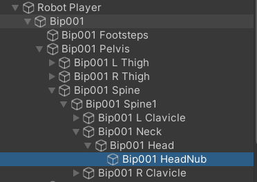
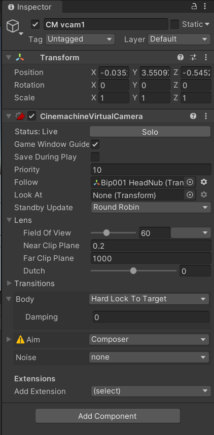

# Studio Beginner Tutorials - First Person Shooter Part 1
  
**Date**: November 16, 2021, 7:00 pm - 9:00 pm<br>
**Location**: Faraday Room 67-124 (Engineering IV)<br>
**Instructors**: Aaron, Ryan
 
## Resources
[Slides](https://docs.google.com/presentation/d/1HeNhXbYw5ydabzrZ79q-_CXQgvbaTx2jRu7gqmSFw3M/edit?usp=sharing)<br>
[Video Soon!](Soon)
 
## Topics Covered
* 3D Movement
* Cinemachine
 
## What you'll need
* [Unity Hub](https://unity.com/download)
* [Unity 2020.3.15f2](https://unity3d.com/unity/qa/lts-releases)
* [Git](https://git-scm.com/downloads)
* [Skeleton Package](https://drive.google.com/file/d/1yUX0b8LTViY-QB0EcMxLRHpEkjvKotUp/view?usp=sharing)

---

## Setting Up Your Scene
In order to start, please download and import the [skeleton package](https://drive.google.com/file/d/1yUX0b8LTViY-QB0EcMxLRHpEkjvKotUp/view?usp=sharing) into your own Unity 3D project. Also make sure that the `Input System`, `Cinemachine`, and `Universal RP` packages are installed. To do this go to Window -> Package Manager -> Unity Registry and install the packages. Then in the project tab under the packages folder inside the assets folder, right click and select Create -> Rendering -> Universal Render Pipeline -> Pipeline Asset (Foward Renderer). Then go back to your main screen and click Edit -> Project Settings -> Graphics and drag your newly created `UniversalRenderPipelineAsset` into the `Scriptable Render Pipeline Settings`.
---

## Player
### Setup + Movement
Create an empty GameObject. Add a Rigidbody and Capsule Collider. The Capsule Collider ensures that the player doesn't fall through the ground or go through walls. Make sure that the Rigidbody has 'Use Gravity' checked and has mass so that the character is affected normally by gravity.

To get our player movement, we attach a `PlayerInput` component with the default action map and a `CharacterMovement` [script](https://github.com/uclaacm/studio-beginner-tutorials-f21/blob/3d-fps-part-i/First%20Person%20Shooter%20Part%20I/Assets/Scripts/CharacterMovement.cs) which is similar to the Roll a Ball and 2D Platformer movement scripts but with C# Events instead of Broadcasted Events.

Within our CharacterMovement script, we start by defining a few SerializeField variables: headCamera and maxSpeed. These variables will help with attaching the camera to the head of the player and making our character's speed editable from the inspector. Then a few variables are defined and initialized for future use. The `Awake()` function is called once before the game starts and is often used to set up references to other scripts and GameObjects, which is exactly what we're doing in our `Awake()` function. Specifically, we are retrieving references to the InputAction from the keyboard, animator, and additionally initializing the cursor to be locked and invisible.

The next part of our code focuses on calling the `Update()` function. Within this function, we set a new `Vector3 deisredForwardVector` to be in the direction that the player is facing (which is based off the camera) without accounting for the y-axis yet because it doesn’t affect movement. Then we rotate the player in this direction with `transform.forward = desiredFowardVector` so that the player is facing the desired direction. After that, we calculate the velocity of the player based on their current velocity and the desired velocity obtained from player input. We use the `Mathf.SmoothDamp` to calculate this velocity because it allows for smooth transitions between movements. Next, we check if the player is falling or landing. If the player is falling, we apply gravity to the vertical speed and if the player is landing, we make the vertical speed 0. Lastly, we move the player with `transform.Translate` and animate the character by calling `animator.SetFloat`.

We want to next check if our player is grounded or not. To do this, we first create a few SerializeField floats to define the dimensions of a box which represents the area at which the player's feet register contact with the ground. We then draw this box (for testing purposes) and use this box to determine if the player is touching the ground. We do this in the FixedUpdate() function to keep our frames in-check with the physics engine.

<br>

Moving on to the smaller functions of our code, we call `OnEnable()` and `OnDisable()` to set up listeners to perform actions only when inputs are received from the keyboard. `HandleChangedMoveDirection` and `HandleCanceledMoveDirection` are used to detect when new directions are inputted into the keyboard and released from the keyboard and changes `desiredDirection` to correspond with them, which is like `OnMove()` from previous tutorials. The last function, `HandleJump()`, is similar to `OnJump()` from previous tutorials and handles the jumping mechanics of the player. The player only jumps when grounded and the vertical speed of the player is also calculated here. 

### Is the player touching the ground?
One of the most important aspects of an FPS (and in many platformers) is detecting whether a player is in contact with the ground. This is used to determine how to change the player's vertical velocity to reflect their relation to the ground. For example, if a player is not touching the ground, we want to increase their vertical velocity downward to simulate falling, whereas if the player has their feet firmly planted on the ground, we don't want the player to have any vertical velocity. 

In the previous tutorials, we have used OnCollisionEnter as a way to detect when the player has contacted the ground. A more precise way of ground detection is through box casting, which is just like *ray* casting in that we project something out into space and see if it hits something. More specifically, box casting is when we send out a literal box out into the world and see if it collides with anything. For ground checking, we want to project a box out from the soles of a player's feet and see if it comes into contact with the ground.

Unity's Physics class gives us access to the `Physics.BoxCast()` method, which we can use for this purpose. Read the documentation for `BoxCast()` and see if you can figure out how to cast a box downwards based on the specifications provided under "Ground Check Box". Note that `Physics.BoxCast()` will return a `true` if it contacts something and `false` if not.

### Jumping
We will now implement jumping! We want our character to jump when the input system notifies it that the user has pressed the jump button (in this case, the space key). To do this, all we need to do is set `verticalSpeed` to a positive value and our update loop will translate our character upwards (taking into account the effects of gravity, of course). To make the character jump higher, all we need to do is increase `verticalSpeed`.

However, we can do better than this. A good practice in game development is to make the variables you expose in project editors easily understandable for your fellow game designers. Level designers think in terms of level geometry (like how high a wall should be so that the player cannot jump over it) and would much more appreciate a metric to measure jump power that reflects this way of thinking. Instead of exposing `verticalSpeed` in the editor, We will expose a field called `jumpHeight` which we as the programmers can then use to derive what `verticalSpeed` should be.

Recall that the kinematics equation for the initial velocity of a mass given the distance traveled **d** through an opposing acceleration of magnitude **a** is sqrt(-2 * **a** * **d**). 


## Using Cinemachine for FPS POV

First we need to create a camera to be our FPS view camera. On the toolbar do Cinemachine -> Create Virtual Camera to spawn in a Cinemachine camera. Now, open up the robot player's hierarchy and find the head piece, which is at Robot Player -> Bip001 -> Pelvis -> Spine -> Spine 1 -> Neck -> Head -> HeadNub (if you're having a hard time finding it, you can look at the solution project in the repo too!).

<br>

 Drag this transform into the "Follow" field of the Cinemachine camera you have just created. Next to the "Body" tab of the Cinemachine editor panel, change "Transpose" to "Hard Lock To Target" and you'll see your camera zip to the positon of the robot's head. We now want the camera to look in the proper direction, so just manually set the rotation of the cinemachine camera to all zeros.

<br>

Open up the script `CharacterLookControllerTutorial.cs`. This script will be attached to the head of our character and will rotate it based on mouse inputs. This script contains a method that will be executed during our camera's movement logic called `PostPipelineStageCallback()`.

First, let's set up a reference to the InputAction that tells us about the rotation inputs derived from the user's mouse. We will use this reference to get information about how much the user's mouse position has changed in this current frame and determine how fast the player should rotate based on these mouse movements.

We can obtain these mouse deltas from the InputAction with the ReadValue<T>() method. From here, we want to use these deltas to rotate the player's head accordingly. The tricky part here is that a change in the mouse's x position across the screen will result in a rotation about the player's y-axis and the change in the mouse's y position across the screen results in a rotation about the player's x-axis. For this reason, the y-angle rotation of the player's head should be based on a change in the x-position of the mouse, while the x-angle rotation should be based on a change in the y-position of the mouse. 

The fields `horizontalSpeed` and `verticalSpeed` are in terms of degrees per pixel (moving one pixel results in one degree of rotation), and the mouse deltas are in terms of pixels. Using this information, determine how many degrees to rotate about the player's x and y axes for this frame.

After calculating our desired player rotations, we want to make sure our rotations have not gone too far so as to put the player's head in awkward or unrealistic angles. For this we use the `Mathf.Clamp()` method, which takes in a value and a range (defined by a min/max pair) and "shoves" that value back within the range if it is outside (returning what that "shoved in" value would be).

The last step is to tell the Cinemachine camera to rotate to the rotation we have specified. The camera rotation can be set by setting the value of `state.RawOrientation` to a quaternion that represents our rotation. Note that we will need to convert our rotation with the `Quaternion.Euler()` method, which converts Euler angles to quaternion.

Now that we're finished with the script, return to the Unity editor and add this component to the Cinemachine camera!

## Notes on Reading User Input
In previous tutorials you learned that Unity's new input system can notify scripts when new inputs have been received by invoking special functions you implement in those scripts that have names corresponding to your defined Actions. In those special functions, scripts can process the new input data however it needs (such as moving the character forward or jumping). 

In this tutorial, we will be using a slightly different approach that makes use of C# events. The base concept is the same -- implement a special function in your script that will process incoming inputs from the input system. The main difference is that instead of letting Unity wire up these special functions to be called by the input system, we will be the ones to do it this time.

Well then why would I want to wire it up myself when Unity can do it for me?

As with all things, doing things yourself gives you more flexibility since you are in control of the implementation. One strength of C# events is that they can be heard by GameObjects that are not directly connected to the PlayerInput object.

--- 

### Final Scripts
After filling out the skeleton code from the package, your scripts should look similar to these. The comments are added for extra understanding.

### Character Movement Script

```c#   
using System;
using System.Collections;
using System.Collections.Generic;
using UnityEngine;
using UnityEngine.InputSystem;

public class CharacterMovement : MonoBehaviour 
{
    [SerializeField] Camera headCamera;
    [SerializeField] float maxSpeed = 5;
    [SerializeField] float jumpHeight = 5;
    Vector2 desiredDirection = Vector2.zero;
    Vector2 currentVelocity = Vector2.zero;
    float verticalSpeed = 0;
    InputAction movementAction;
    InputAction jumpAction;
    Animator animator;

    const float GRAVITY = 9.8f;
    bool isGrounded = false;

    // SMOOTHING VARS
    float smoothTime = 0.1f;
    Vector2 refCurVel;

    void Awake()
    {
        // Get a reference to the specific InputAction of the object. This is the component that will broadcast an event
        // whenever it receives a new WASD input from the user (including letting go of keys).
        movementAction = GetComponent<UnityEngine.InputSystem.PlayerInput>().actions.FindActionMap("Player").FindAction("Movement");
        jumpAction = GetComponent<UnityEngine.InputSystem.PlayerInput>().actions.FindActionMap("Player").FindAction("Jump");

        // Get a reference to the animator. This is the component that will help us play the correct movement animations
        // based on the velocity of the player.
        animator = GetComponent<Animator>();


        // Make sure our mouse is invisible and locked within the game screen (so that the player doesn't have to worry about
        // it going all over the place when they're trying to play)
        Cursor.visible = false;
        Cursor.lockState = CursorLockMode.Locked;

    }

    void Update()
    {
        // Determine the direction that the player's head is facing (not taking into account the y-axis). This is the
        // direction we want our player to move in.
        Vector3 desiredForwardVector = new Vector3(headCamera.transform.forward.x, 0, headCamera.transform.forward.z);

        // Rotate the player's transform so that they are now facing in the direction that their head was pointing.
        transform.forward = desiredForwardVector;
        
        // Calculate the velocity of the player by smoothly interpolating between their current velocity and the velocity
        // we want indicated by our arrow keys. Note that if we just immediately assigned the velocity to the player's
        // WASD input, the player's character would jolt abruptly upon changing directions, which doesn't feel good.
        // Essentially what Mathf.SmoothDamp() does is it takes in the velocity you're at (currentVelocity),
        // the velocity you WANT to be at (desiredDirection * maxSpeed), a variable it can use to store some data (refCurVel),
        // and a factor that determines how slowly you want to ease between your current and desired velocities (smoothTime)
        currentVelocity.x = Mathf.SmoothDamp(currentVelocity.x, desiredDirection.x * maxSpeed, ref refCurVel.x, smoothTime);
        currentVelocity.y = Mathf.SmoothDamp(currentVelocity.y, desiredDirection.y * maxSpeed, ref refCurVel.y, smoothTime);

        // Check whether the player is on the ground (as it will affect the velocity)
        if(!isGrounded)
            verticalSpeed -= GRAVITY * Time.deltaTime;
        else if(verticalSpeed <= -0.1f)     // IF player was just falling and is now grounded, set their speed to 0
        {
            verticalSpeed = 0;
            animator.ResetTrigger("HasJumped");
        }
            
        // else, don't change the vertical speed (since this means the player is grounded and does not have any vertical velocity)

        // Finally, move the player
        transform.Translate(new Vector3(currentVelocity.x, verticalSpeed, currentVelocity.y) * Time.deltaTime);

        // Tell the animator what the player's velocity is so that it knows how to animate the character
        animator.SetFloat("VelocityX", currentVelocity.x);
        animator.SetFloat("VelocityZ", currentVelocity.y);
    }

    [Header("Ground Check Box")]
    [SerializeField] Transform feetTransform;
    [SerializeField] float groundCastDist = 1f;
    [SerializeField] float sideLength = 0.5f;
    [SerializeField] float boxDepth = 0.1f;
    void FixedUpdate()
    {
        isGrounded = Physics.BoxCast(feetTransform.position, new Vector3(sideLength/2, boxDepth, sideLength/2), 
                        Vector3.down, Quaternion.identity, groundCastDist);
        animator.SetBool("IsGrounded", isGrounded);
    }

    void OnDrawGizmos()
    {
        Gizmos.color = Color.green;
        Gizmos.DrawWireCube(feetTransform.position + Vector3.down * groundCastDist, new Vector3(sideLength, boxDepth, sideLength));
    }

    
    void OnEnable()
    {
        // Set up listeners for events that are broadcast when new inputs are received from the player.
        // Remember that we want this event-listener model because it means we only need to do work
        // when there's new information for us (which is much better than polling for input).
        movementAction.performed += HandleChangedMoveDirection;
        movementAction.canceled += HandleCanceledMoveDirection;
        jumpAction.performed += HandleJump;
    }

    
    void OnDisable()
    {
        // It's best practice to unsubscribe from events before you "leave" so that the event doesn't
        // try to invoke any methods that no longer function.
        movementAction.performed -= HandleChangedMoveDirection;
        movementAction.canceled -= HandleCanceledMoveDirection;
        jumpAction.performed -= HandleJump;
    }

    // This is the method that is triggered when a new direction is pressed, not including when directions are released, which
    // is handled in HandleCanceledMoveDirection()
    private void HandleChangedMoveDirection(InputAction.CallbackContext inputContext)
    {
        desiredDirection = inputContext.ReadValue<Vector2>();
    }

    // The input system detects returning to the default state as the movement input being "canceled" rather than "changed"
    private void HandleCanceledMoveDirection(InputAction.CallbackContext inputContext) 
    {
        desiredDirection = Vector2.zero;
    }

    private void HandleJump(InputAction.CallbackContext inputContext)
    {
        if(!isGrounded) {return;}

        verticalSpeed = Mathf.Sqrt(2*GRAVITY*jumpHeight);
        animator.SetTrigger("HasJumped");
    }
}
```

### Character Look Controller
```c# 

using System.Collections;
using System.Collections.Generic;
using UnityEngine;
using Cinemachine;
using UnityEngine.InputSystem;

public class CharacterLookController : CinemachineExtension
{
    // Cinemachine extension from https://www.youtube.com/watch?v=5n_hmqHdijM
    [SerializeField] PlayerInput playerInput;
    InputAction rotationAction;
    Vector3 startingRotation;       // Represents the angle to turn the head left-right (y) and up-down(x)


    // Camera look variables
    [SerializeField] float horizontalSpeed = 10;
    [SerializeField] float verticalSpeed = 10;
    [SerializeField] float verticalClampAngle = 80;     // Prevents the camera from rotating past this angle

    protected override void Awake()
    {
        rotationAction = playerInput.actions.FindActionMap("Player").FindAction("Rotation");
        base.Awake();
    }

    // This callback is invoked when this Cinemachine camera changes to a new state (it cycles through 4 stages)
    protected override void PostPipelineStageCallback(CinemachineVirtualCameraBase vcam, CinemachineCore.Stage stage, ref CameraState state, float deltaTime)
    {   
        // If this Cinemachine camera is set to a Follow target
        if(vcam.Follow)
        {
            // If this state that we're on is the AIM state
            if(stage == CinemachineCore.Stage.Aim)
            {
                // If the rotation that we intend to give to the player's camera has not yet been initialized, initialize it
                // to the current rotation of the camera
                if(startingRotation == null)
                    startingRotation = transform.localRotation.eulerAngles;

                // Figure out what the last change in mouse position was
                Vector2 mouseDelta = rotationAction.ReadValue<Vector2>();

                // Adjust the rotation that we intend to give the player's camera so that it accounts for inputs received
                // from the user through their mouse movements. Remember that when we move our mouse on the horizontal
                // axis, that corresponds to a rotation about the y-axis. And when we move our mouse on the vertical axis,
                // that corresponds to a rotation about the x-axis. This is why the x and y values below are swapped.
                startingRotation.y += mouseDelta.x * horizontalSpeed * Time.deltaTime;
                startingRotation.x += mouseDelta.y * verticalSpeed * Time.deltaTime;

                // The Mathf.Clamp() function is used to keep the starting rotation from going too far (the player shouldn't
                // be able to rotate their head forever!)
                startingRotation.x = Mathf.Clamp(startingRotation.x, -verticalClampAngle, verticalClampAngle);

                // Finally, now that we've applied the effects of our latest inputs, we set the cinemachine camera's rotation
                state.RawOrientation = Quaternion.Euler(-startingRotation.x, startingRotation.y, 0);

            }
        }
    }
}


```

---
## Essential Links
- [Studio Discord](https://discord.com/invite/bBk2Mcw)
- [Linktree](https://linktr.ee/acmstudio)
- [ACM Membership Portal](https://members.uclaacm.com/)
## Additional Resources
- [Unity Documentation](https://docs.unity3d.com/Manual/index.html)
- [ACM Website](https://www.uclaacm.com/)
- [ACM Discord](https://discord.com/invite/eWmzKsY)
 
