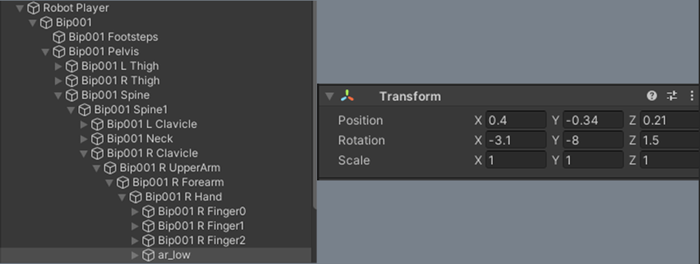
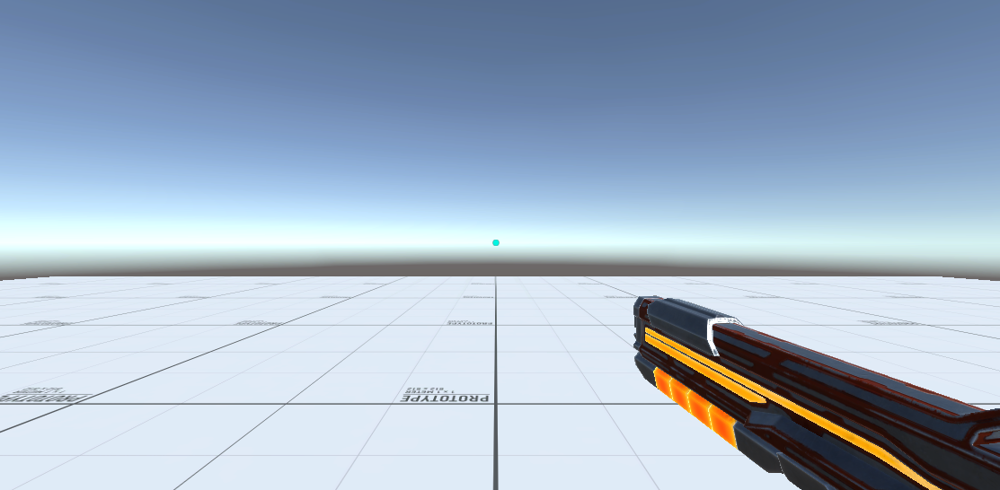
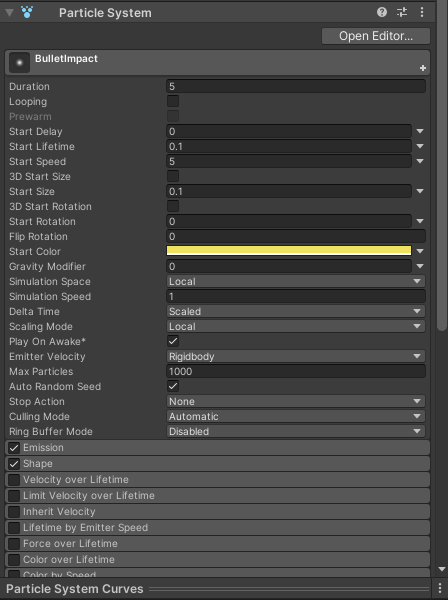

# Studio Beginner Tutorials - First Person Shooter Part 2
**Date**: November 22, 2021, 7:00 pm - 9:00 pm<br>
**Location**: Faraday Room 67-124 (Engineering IV)<br>
**Instructors**: Aaron, Ryan, Peter
 
## Resources
[Slides](https://tinyurl.com/fps-pt2-slides)<br>
[Video Soon!](Soon)
 
## Topics Covered
* Raycasting 
* Visual effects
 
## What you'll need
* [Unity Hub](https://unity.com/download)
* [Unity 2020.3.15f2](https://unity3d.com/unity/qa/lts-releases)
* [Git](https://git-scm.com/downloads)
* [Skeleton Package](https://drive.google.com/file/d/1iBEHVB0h4kvV9vrjSQu67mH5sxpSFgXY/view?usp=sharing)

---

## Setting Up Your Scene
In order to start, please download and import the [skeleton package](https://drive.google.com/file/d/1wDDwZ2g7ZNl5fqpcHdeksNHW4EdDIecW/view?usp=sharing) into your own Unity 3D project and open the `Tutorial_Scene`. If you are continuing the tutorial from part 1, please copy the [target](https://github.com/uclaacm/studio-beginner-tutorials-f21/blob/main/First%20Person%20Shooter%20Part%20II/Assets/Scripts/Target_Tutorial.cs) and [fire gun](https://github.com/uclaacm/studio-beginner-tutorials-f21/blob/main/First%20Person%20Shooter%20Part%20II/Assets/Scripts/FireGun_Tutorial.cs) tutorial scripts into your assets folder.

Also make sure that the `Input System`, `Cinemachine`, and `Universal RP` packages are installed. To do this go to Window -> Package Manager -> Unity Registry and install the packages. Then in the project tab under the packages folder inside the assets folder, right click and select Create -> Rendering -> Universal Render Pipeline -> Pipeline Asset (Foward Renderer). Then go back to your main screen and click Edit -> Project Settings -> Graphics and drag your newly created `UniversalRenderPipelineAsset` into the `Scriptable Render Pipeline Settings`.

---

## Shooting
### Setup + Target
Before we start writing our script to implement our shooting mechanics, let's add a reticle. Create a canvas and add an image as its child. Set the anchor of the image to be centered and the adjust the size to your liking. Usually, FPS games have it so that you can see your gun the entire time you're playing and it makes it a little nicer. But right now, the gun doesn't follow our camera movements and we can't see it for the most part. In order to quickly fix that, we can go to the gun prefab on our player model (which can be found in Robot Player -> Bip001 -> Pelvis -> Spine -> Spine1 -> R Clavicle -> R UpperArm -> R Forearm -> R Hand; or by double clicking the gun in the scene). We can then drag the gun from this position into the Main Camera, making it a child of the Main Camera, meaning that each movement of the camera will be mirrored to the gun. Next, we can change the Transform of the gun to fit our screen better.

<br>

<br>

Next, let's set up target. To accomplish this, create an empty GameObject and add a Sphere Collider. The Collider will be used for detecting collisions with the raycast drawn from our gun. We can add the following `Target` script to our GameObject, which will initialize an HP value that will be subtracted whenever the target is hit. We define a public method `TakeDamage()` that will subtract the specified amount of HP and call the methodd `Die()` that will destroy the object when the target's HP reaches zero.

```csharp
public class Target : MonoBehaviour
{
    // initializing hp
    public float hp = 1f;

    // take damage function
    public void TakeDamage(float amount)
    {
        // decrease hp by an amount and if hp reaches 0, the target dies.
        hp -= amount;
        if(hp <= 0f)
        {
            Die();
        }
    }

    void Die()
    {
        Destroy(gameObject);
    }
}
```

### What is a raycast?
A ray in Unity can be thought of as a vector that starts at a point and has a direction. Unity's Physics raycast class provides a way to cast a ray originating from a `point` origin in a direction `direction` of length `maxDistance`. Anything that has a collider which the ray passes through will be stored in an `out` parameter. In the context of our FPS, we can use raycasts to implement hit detection for bullets. 

Note that an alternative method to raycasting is simulating the projectile motion of bullets. Although this will not be demonstrated in this tutorial, one can implement projectiles that spawn with a certain velocity whenever a shot is fired and have the bullets themselves handle collision.

However, raycasting is still used in many FPS games such as `CSGO`, `Doom`, and `Call of Duty` because the velocity of bullets is so fast and the size of bullets small enough that the mechanics can be sufficiently simulated using raycasts.

### Implementing firing
We will now implement firing! Let's create a script called `FireGun` which will contain the logic for shooting. Similar to how we implemented movement and jumping in [part 1](https://github.com/uclaacm/studio-beginner-tutorials-f21/tree/3d-fps-part-ii/First%20Person%20Shooter%20Part%20I#character-movement-script), we'll need a reference to a specific InputAction of an object. This is the component that will broadcast a mouse-click event. We can then set up listeners that will subscribe to a function called `HandleFire()` on `OnEnable()` and unsubscribe to the function on `OnDisable()`. We'll access the `performed` callback from the `InputAction` reference, which will indicate that the interaction of the action has been completed.

The `HandleFire()` method will cast a ray from the `CM Virtual Camera` representing our head and detect any collisions, which will be stored in the variable `hit`. The `out` keyword indicates that the given parameter can be initialized and given a value within the function call.
```csharp
 private void HandleFire(InputAction.CallbackContext inputContext)
    {
        // defining raycast variable to store later
        RaycastHit hit;

        // Checking if we hit something. Physics.Raycast returns true if something is hit. We pass in headCamera.transform.position to get the starting position
        // of the ray. Then headCamera.transform.forward to get the direction of the ray. Then we store the object we hit into our 'hit' variable.
        if (Physics.Raycast(headCamera.transform.position, headCamera.transform.forward, out hit))
        {
            // logging name of object that was hit.
            Debug.Log(hit.transform.name);

            // getting target hit
            Target target = hit.transform.GetComponent<Target>();

            // if a target was actually hit
            if (target != null)
            {
                // decrease hp of target by 1
                target.TakeDamage(1f);
            }
        }
    }
```

## Bullet impacts using Particle System
To generate particles that'll be used in our bullet impact effect, we can leverage Unity's Particle System. It's a powerful tool that can be used to generate a variety of effects from liquids, smoke, clouds, flames, and more! Navigate to `GameObject->Effects->Particle Systems` which should add a `Particle System` to your game hierarchy. In the inspector, a window with the following properties should appear.

<br>

We'll use these settings to create a small spark effect that will be played whenever a raycast is drawn from the gun. These are the settings to create the effect used in this tutorial with brief explanation of each property. Feel free to experiment with the other modules and settings in the particle system editor to create something unique! Additionally, you can refer to [Unity's documentation](https://docs.unity3d.com/ScriptReference/ParticleSystem.html) on particle systems for more information.

- **Duration**: If looping isn't checked, this setting determines how many seconds the Particle will play.
- **Looping**: Checking this option means the Particle will repeat. Unchecking this option will cause the Particle to only play once.
- **Start Lifetime**: The initial lifetime in seconds for the particle. The particle is destroyed after the elapsed time.
- **Start Size**: Initial size of the particles. <br>

We'll also need to add the following lines of code in our `HandleFire()` method to instantiate the effect whenever a ray collides with another object. We'll call the `Instantiate` method which will take in a `GameObject` as its first parameter to copy, so we should make our particle system a prefab and assign it to a variable in our script. The second argument takes in a `Vector3` in world space, so we pass it the location where the ray intersected with a collider. The third argument to the function takes in a Quaternion rotation so we use Quaternion.LookRotation() to take in a direction and convert it into a Quaternion. The direction we want is the normal vector because it will point out from the direction we shot in, so we pass in 'hit.normal'.

```csharp
...
GameObject impactGameObject = Instantiate(impactEffect, hit.point, Quaternion.LookRotation(hit.normal));
Destroy(impactGameObject, 2f);
```

## Sidequest
Right now the game is pretty boring since we just shoot a target and it dies. To make it more fun, we can have the target spawn a new target somewhere else each time it dies. By adding the below code into the Target Die() function and attaching a new target GameObject and headCamera reference, we can generate a new target each time one dies.

```csharp
Instantiate(newTarget, new Vector3(headCamera.transform.position.x + Random.Range(5, 15),
            headCamera.transform.position.y + Random.Range(0, 3), headCamera.transform.position.z + Random.Range(5, 15)),
                Quaternion.LookRotation(headCamera.transform.forward));
```

---
## Essential Links
- [Studio Discord](https://discord.com/invite/bBk2Mcw)
- [Linktree](https://linktr.ee/acmstudio)
- [ACM Membership Portal](https://members.uclaacm.com/)
## Additional Resources
- [Unity Documentation](https://docs.unity3d.com/Manual/index.html)
- [ACM Website](https://www.uclaacm.com/)
- [ACM Discord](https://discord.com/invite/eWmzKsY)
 
