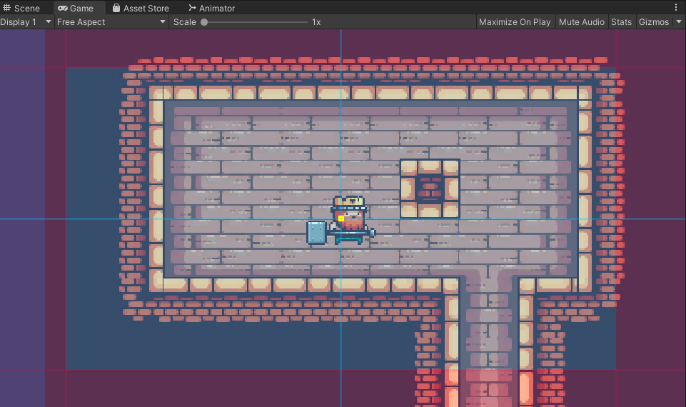
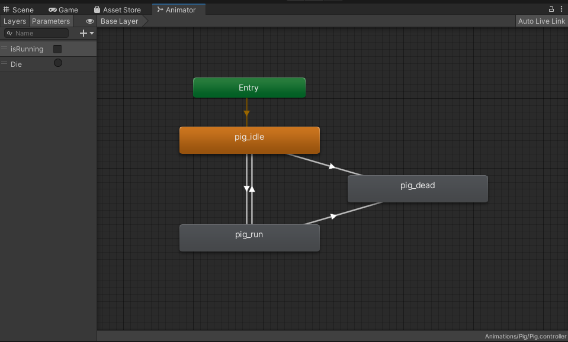

# Studio Beginner Tutorials - 2D Platformer Part 2 
  
**Date**: November 9th, 2021, 7:00 pm - 9:00 pm<br>
**Location**: Faraday Room 67-124 (Engineering IV)<br>
**Instructors**: Connor, Peter, Richard
 
## Resources
Slides<br>
Video
 
## Topics Covered
* Destructible tiles
* Cinemachine
* Enemies and combat
 
## What you'll need
* [Unity Hub](https://unity.com/download)
* [Unity 2020.3.15f2](https://unity3d.com/unity/qa/lts-releases)
* [Git](https://git-scm.com/downloads)
* [Kings and Pigs Assets](https://pixelfrog-assets.itch.io/kings-and-pigs)

---
## Cinemachine

### Setup
Currently, we have the `Main Camera` as a child of the `Player`, which will cause the camera to always have the player be at the center of the screen. One issue is this camera setup is that it can be difficult for the player to see what's in front of them. To solve this issue, we can make the camera to be more dynamic and configurable such that it reacts to where the player is on the screen and movement.

`Cinemachine` is a state-driven suite of camera modules that allows us to easily configure animation states, implement tracking, dolly, shake, and more. To setup `Cinemachine`, first install the package by navigating to `Window->Package Manager` and install the `Cinemachine` package in the `Unity Registry` section.

### Implementing the camera
After installing `Cinemachine`, a new tab should appear to right of `Component` in the upper taskbar. Click `2D Virtual Camera` to add a `CM virtual camera` to our scene. This will be a camera with some settings configured for a 2D scene. Specifically, the `Framing Transposer` under the `Body` settings window will follow a target on the camera's X-Y plane, and prevent rotation.

We'll set the `Follow` setting to the `Player` transform. You should see a grid appear in the game view with a yellow dot on the target we're tracking.
<br>

### Settings Overview
**Lookahead Time**:  The composer will adjust its target offset to look at a point where the target may be in x seconds into the future. This setting is useful for tracking the target if it's moving fast towards the edge of the frame.<br>

**X, Y, Z Damping**: Determines how aggressively the camera maintains the offset on a specified axis. A low damping value means the camera snap faster to its target offset while a larger damping value means the camera will respond slower to the target offset, yielding in smoother movement.<br>

**Screen X, Y:** Moves the camera such that the target is positioned to the corresponding X,Y screen coordinates. Note that screen coordinates of (0,0) correspond to the bottom left of the screen while the coordinates of (1,1) correspond to the bottom right of the scren. <br>

**Dead Zone Width/Height/Depth**: Increasing this value will cause the blue lines to expand either horizontally or vertically. Any movement of the target within this area will not cause the camera move.<br>

**Soft Zone Width/Height**<br>
If the target enters the soft zone, the camera will reorient itself to frame the target in the dead zone. Note that damping values affect how quickly this readjustment occurs.

## Destructible Tilemaps

### Setup
A common mechanic in platformers are destructible walls and platforms. To add this into our platformer, we will write a script which will delete tiles from our `Tilemap` when something collides with the tile. But first, create a new `2D Object → Tilemap → Rectangular` as a child of the `Grid` game object that already holds our existing tilemaps. We need a separate `Tilemap` since we don't want to delete tiles from platforms that aren't supposed to be destructible. Remember to attach `Tilemap Collider 2D` and `Composite Collider 2D` components, and set the `Rigidbody2D` to static so that other things will be able to collide with our new `Tilemap`! Finally, paint in some tiles into the new tileamp in easily accessible locations so you can test destroying them later.

### Deleting Tiles
Create a new [`DestructibleTilemap` script](https://github.com/uclaacm/studio-beginner-tutorials-f21/blob/main/Platformer%20Part%20I/Assets/Scripts/DestructibleTilemap.cs) and attach it to your new `Tilemap`. Add a member variable referencing the `Tilemap` that's attached to the same game object as our script. You'll also need to add `using UnityEngine.Tilemaps;` at the top of your script. To delete tiles from the tilemap, we can use `tilemap.SetTile(Vector3Int position, null)` since setting a tile to null removes it from the tilemap. The function below iterates over each point where the `Composite Collider 2D` touches another collider, and deletes the tile at the point of contact. Note that we add a small offset (`0.01f`) in the direction of the vector normal to the surface at the contact point so that we delete the correct tile, since the contact points are all on the edge of our tiles.

```c#
// Find position of tiles being collided with and trigger their deletion
private void TriggerDeletions(Collision2D collision)
{
	// Iterate over all points where the collider is touching something
	Vector3 tilePosition = Vector3.zero;
	foreach (ContactPoint2D contact in collision.contacts)
	{
		// Add small offset to delete correct tile
		tilePosition.x = contact.point.x + offset * contact.normal.x;
		tilePosition.y = contact.point.y + offset * contact.normal.y;
    
		// Delete the tile from our tilemap
		tilemap.SetTile(tilemap.WorldToCell(tilePosition), null);
	}
}
```

Call this function within `void OnCollisionStay2D(Collision2D collision)` so that we delete tiles when the player collides with them. If you play the game, you should see that when the player runs into or onto a destructible tile, the tile is instantly deleted. While you can now create hidden rooms and fake walls, deleting tiles instantly isn't so great if we want a platform that will collapse after we run over it. To implement a delay between detecting the collisions and actually deleting the tiles, we can use coroutines.

### Coroutines
Couroutines are a special type of function in Unity which allow you to pause execution of your code and then return to it later. In our case, we can start the process of deleting a tile, pause our coroutine, and then actually delete the tile after the delay.

Coroutines always have an `IEnumerator` return type, and within your coroutine you will need to use `yield return` instead of just `return`. Unity provides some very useful `YieldInstructions` that can be used with `yield return`, such as `new WaitForSeconds(float seconds)` which will pause the coroutine for approximately the provided number of seconds. You can also use `yield return null` to only pause your coroutine until the next frame of the game. Finally, to actually run a coroutine, instead of calling it like a regular function (`ExampleCoroutine(inputParameter);`), coroutines are started with `StartCoroutine()` (`StartCoroutine(ExampleCoroutine(inputParameter));`). If you would like to learn more about coroutines and how to use them, you can take a look at the [Programming Essential workshop](https://github.com/uclaacm/studio-advanced-tutorials-f21/tree/main/Programming%20Essentials) from the Advanced Track.

```c#
[SerializeField] private float deletionDelay = 0.5f;	// How long to wait before deleting a tile

private IEnumerator DeleteTileDelayed(Vector3 tilePosition)
{
	// Only need to wait if delay is non-negative
	if (deletionDelay > 0)
	{
		yield return new WaitForSeconds(deletionDelay);
	}

	// Actually delete tile after delay
	tilemap.SetTile(tilemap.WorldToCell(tilePosition), null);
}
```

The function above shows an implementation of waiting a number of seconds before deleting tiles. If you call `DeleteTileDelayed()` from `TriggerDeletions()` and play the game, you should now see that a tile that you walk into or onto will only delete itself after a short delay. However, if you have multiple destructible tiles next to each other and walk over them, you may notice that only the first tile you touch is deleted. This is because we called `TriggerDeletions()` from `OnCollisionEnter2D` — when we move from one tile to the next we don't enter the collider again, since we no longer exit the collider when the tile is instantaneously deleted. To fix this, also call `TriggerDeletions()` from `OnCollisionStay2D`. Now you should be able to run over a destructible platform and have it collapse behind you!

### Bonus Sidequests
One disadvantage of calling `TriggerDeletions()` from `OnCollisionStay2D` is that our player will trigger the deletion of the same tile many times before the tile is actually deleted, slowing down our game. This problem is worsened by longer delays before deletion, and could cause problems down the line if we need to add back a tile in the same position, since it could be deleted by the deletions that have been "buffered". You can solve this by checking whether the tile has already been marked for destruction in your coroutine - the example implementation uses `HashSet<>` to keep track of which tiles are marked for deletion.

You can also extend your newfound knowledge to create moving platforms! By moving a tilemap around, you can move all of the platforms within the tilemap. You can use coroutines or the animation state machine to create platforms that move in a specific pattern.

Finally, our tilemap currently deletes tiles whenever anything collides with it - not just the player. While this can be a good thing (such as allowing enemies to destroy platforms by running over them!), you may also want to have platforms that are only destroyed by certain objects or types of objects. For example, you could modify your DestructibleTilemap script to only delete tiles when the tile touches a bomb!

## Enemies and Combat

### Setup 
Similar to the player, we'll be setting up the sprite sheet for the enemy which will be a pig. Navigate to the folder called `Kings and Pigs->Sprites-> 03-Pig`. We'll be configuring spritesheets for the running, idle, and death animation. Click on one of the sprites and set the `Sprite Mode` to `Multiple`. Next, click `Sprite Editor` in the inspector and slice the sprites according the cell size (34 x 28). We won't be using the automatic setting since sprite won't always be centered across different animations.

### Animator Controller
 <br>
Add an animation controller with the following animation states and parameter. If you need a refresher on how to configure animations in Unity, you can refer to [Part I](https://github.com/uclaacm/studio-beginner-tutorials-f21/tree/main/Platformer%20Part%20I) of this tutorial series!

### Enemy Movement
Finally, we can configure a movement script for the enemy, which will cause it to patrol back and forth between two points that we specify. Note that we will also need to manually flip the sprite when it is moving to the right, similar to the player.
```csharp
public class EnemyMovement : MonoBehaviour
{
    enum Direction {left = -1, right = 1};
    private Rigidbody2D rb;
    private Animator animator;
    public float speed;
    
    // Initial orientation of the sprite renderer
    private Vector3 initScale;

    // Set boundaries for patrol
    [SerializeField] private Vector3 leftEdge;
    [SerializeField] private Vector3 rightEdge;

    // Check if we're moving in a certain direction
    private bool movingLeft;

    // Start is called before the first frame update
    void Start()
    {
        rb = GetComponent<Rigidbody2D>();
        animator = GetComponent<Animator>();
        initScale = transform.localScale;
        movingLeft = true;
    }

    // Update is called once per frame
    void Update()
    {   
        if (movingLeft)
        {
            // If we hit the boundary, have the enemy switch direction
            if ( transform.position.x < leftEdge[0])
                movingLeft = false;
            Move(Direction.left);
        }
        else
        {
            if ( transform.position.x > rightEdge[0])
                movingLeft = true;
            Move(Direction.right);
        }
    }
    
    void Move(Direction dir)
    {
        // Set animator boolean for movement
        animator.SetBool("isRunning", true);

        switch (dir)
        {
            case Direction.left:
                // Keep initial orientation of sprite is moving left
                transform.localScale = new Vector3(Mathf.Abs(initScale.x), initScale.y, initScale.z);
                break;
            case Direction.right:
                // Otherwise, we flip the sprite
                transform.localScale = new Vector3(Mathf.Abs(initScale.x) * -1, initScale.y, initScale.z);
                break;
        }

        // Have enemy move in the specified direction
        rb.velocity = new Vector2(speed * (int) dir, rb.velocity.y);
    }
}
```
### Bonus Sidequests
Instead of having the enemy move back and forth between two points, would it be possible to make the pig move in a random direction for a certain amount of time? 

Can you implement enemies jumping?

What if enemies locked on to the player once they approached a certain distance?

---
## Player Combat

### Player Taking Damage
Now we want the player to be able to take damage when it comes in contact with the enemy. To do this we are going to modify the `PlayerMovement` script that we made in [Part I](https://github.com/uclaacm/studio-beginner-tutorials-f21/tree/main/Platformer%20Part%20I) of this tutorial series. First we will add some variables that will be used to implement this feature.

```csharp
public class PlayerMovement : MonoBehaviour
{
    private float horizontal;
    private float vertical;
    private Vector2 position;

    private Rigidbody2D rb;
    private Animator animator;

    private bool moveLock;
 
    public bool grounded;
    public float speed;
    public float jumpHeight;

    public int health;
    public float knockbackX;
    public float knockbackY;

    void Start()
    {
        rb = GetComponent<Rigidbody2D>();
        animator = GetComponent<Animator>();

        position = rb.position;
        grounded = false;


        moveLock = false;
    }
```
We add `movelock` to lock the players movement when it is knocked back from the enemy, `knockbackX` and `knockbackY` to control how much the player gets knocked back, and `health` to make the player take damage. 

Now we want the player to take damage and be knocked back if it collides with the enemy, so we modify the `OnCollisionEnter2D` function. 
```csharp
private void OnCollisionEnter2D(Collision2D collision)
{
    if (collision.gameObject.tag == "Ground")
    {
        grounded = true;
        animator.SetBool("isJumping", false);
    }
    if (collision.gameObject.tag == "Enemy")
    {
        health--;
        int dir = collision.gameObject.GetComponent<Transform>().position.x > rb.position.x ? -1 : 1;
        horizontal = 0;
        vertical = 0;
        moveLock = true;
        rb.velocity = new Vector2(knockbackX*dir, knockbackY);
        animator.SetBool("isJumping", false);
        animator.SetBool("hit", true);
    }
}
```
We need to make sure that we add the `Enemy` tag to the enemy for this to work. Don't worry about the animator booleans, we will take care of those in a bit. We set the `movelock` variable on here to make the player get knocked back from the enemy without interference from player input. For this to work we need to now modify the `OnMove` and `FixedUpdate` functions as follows

```csharp
void OnMove(InputValue movementVal)
{
    if (!moveLock)
    {  
        horizontal = 0;
        vertical = 0;
        Vector2 movement = movementVal.Get<Vector2>();
        horizontal = movement.x * speed;
        if (movement.y > 0 && grounded)
        {
            vertical = jumpHeight;
        }
    }
}
private void FixedUpdate()
{    
    if (!moveLock)
    {
        rb.velocity = new Vector2(horizontal, vertical <= 0 ? rb.velocity.y : vertical);
    }
    vertical = 0;
}
```
Now there won't be any interference in the knockback due to user input. But we need a way to set `movelock` back after the player has been knocked back. We will add the `endHit` function below which we will call as an animation event.
```csharp
public void endHit()
{
    Debug.Log("end");
    animator.SetBool("hit", false);
    moveLock = false;
}
```

### Animation
We will be setting up another sprite sheet and creating an animation for the player taking damage. Navigate to the folder called `Kings and Pigs->Sprites->01-King Human`, select the `Hit` spritesheet and set the `Sprite Mode` to `Multiple` and the `filter mode` to `point (no filter)`. Next, click `Sprite Editor` in the inspector and we will just use the automatic slicing. Use these sprites to make an animation for the player. Add an `Animation Event` to the last frame of the animation that calls the `endHit` function.

In the animation controller we now have a `hit` state. Create a `hit` boolean and add a transition from `Any State` to the `hit` state that occurs when the `hit` variable is true. When clicking on the transition, in the `Inspector`  window turn off `Has Exit Time` and expand the `Settings` dropdown to disable `Can Transition To Self`. This will make it so the animation will play out one full time and then transition to the next state instead of constantly restarting as long as the `hit` boolean is `true`. Now we want the player taking damage animation to override the jump animation, so add the requirement that `hit` is `false` to the transition from `Any State` to `Jump`.

### Player Attacking
To make the player attack we are again going to be modifying the `PlayerMovement` script. We will add an `OnFire` function to attack when the `Fire` input is detected
```csharp
void OnFire()
{
    if(!animator.GetBool("isJumping") && !animator.GetBool("hit"))
        animator.SetTrigger("attack");
}
```
Now go back to the `Kings and Pigs->Sprites->01-King Human` folder and select the `Attack` spritesheet. set the `Sprite Mode` to `Multiple` and the `filter mode` to `point (no filter)`, then click `Sprite Editor` in the inspector and slice the sprites according the cell size (78 x 58). Create a new animation for the player and drag these sprites to add them to the animation. To make it so we can detect if the player's attack hits we can add a hitbox. For this we will use a `CircleCollider2D`. Add this to the player and turn on `IsTrigger`. Uncheck the box at the top of the component in the `Inspector` window to set it inactive. We only want this collider to be active when the player is attacking; we can do this in the `animation` window. Select the player and select the `Attack` animation in the animation window. Click the recording button. Now we can make changes to the components of the player and these changes will be added to the animation. When on the first frame of the animation, turn on the `CircleCollider2D` and edit the collider to cover the area that you want to be included in the attack. Adjust the size of the collider at the different frames of the animation to fit where you want the attack range to be and then in the last frame deactivate the collider. Now to make the animation activatable, add a trigger called `attack` in the animation controller for the player and make a transition from `Any State` to the `attack` state. Make sure to set it to set it to have no exit time. Now the player can attack.

### Bonus Sidequests
Add a death animation for the player so that something happens when the player reaches zero health.

Edit the `PlayerMovement` or `EnemyMovement` scripts to make it so that the enemy takes damage from the player's attack.

---

## Essential Links
- [Studio Discord](https://discord.com/invite/bBk2Mcw)
- [Linktree](https://linktr.ee/acmstudio)
- [ACM Membership Portal](https://members.uclaacm.com/)
## Additional Resources
- [Unity Documentation](https://docs.unity3d.com/Manual/index.html)
- [ACM Website](https://www.uclaacm.com/)
- [ACM Discord](https://discord.com/invite/eWmzKsY)
 
 
 
