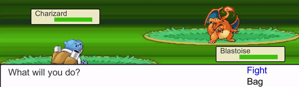
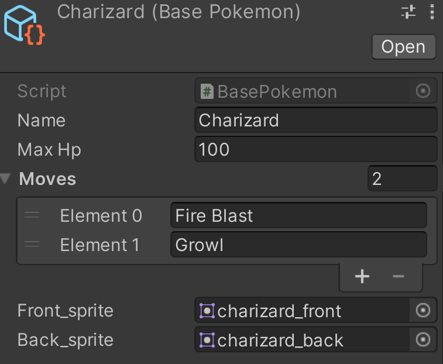
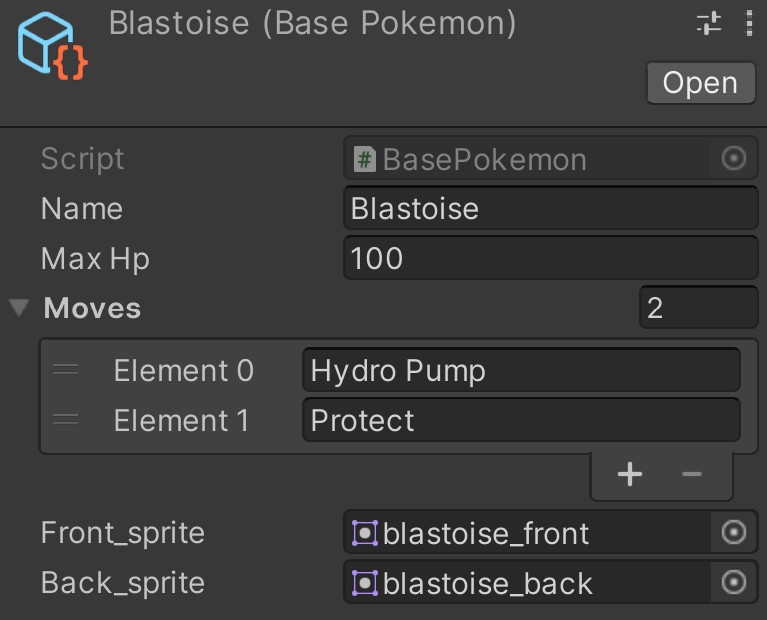

# Studio Beginner Tutorials - Build an RPG: Combat

**Date**: January 18, 2022, 7:00 pm - 9:00 pm<br>
**Location**: Zoom<br>
**Instructors**: Connor, Ryan

## Resources
[Slides](https://docs.google.com/presentation/d/11wem-UyzL3qNAjySi4kznZZQPnx7d6gA_zXDun6X59s/edit?usp=sharing)<br>
[Video Soon!](Soon)
 
## Topics Covered
* UI Elements
* Creating Characters Using Scriptable Objects
* Turn Based Combat Mechanics and Design
 
## What you'll need
* [Unity Hub](https://unity.com/download)
* [Unity 2020.3.15f2](https://unity3d.com/unity/qa/lts-releases)
* [Git](https://git-scm.com/downloads)
* [Skeleton Package](https://drive.google.com/file/d/1_rJrWlnJ4S6iisUc1YaWXbiayqx7GPou/view?usp=sharing)

---

## Final Product


## Setting Up Your Scene
In order to start, please download and import the [skeleton package](https://drive.google.com/file/d/1_rJrWlnJ4S6iisUc1YaWXbiayqx7GPou/view?usp=sharing) into your own Unity 2D project. Note: all finalized scripts can be found [here](https://github.com/uclaacm/studio-beginner-tutorials/tree/main/Pokemon_Combat/Assets/Scripts/Battle) or under `/Assets/Scripts/Battle/` within the readme. 
---

## The Scene
The [skeleton package](https://drive.google.com/file/d/1_rJrWlnJ4S6iisUc1YaWXbiayqx7GPou/view?usp=sharing) includes all the assets needed for the scene and has things set up so that we can add scripts to make it playable. Before we get into that though, we want to go over what is in the scene. The scene should look like this:

<br>

The first thing to note is the BattleSystem object. This is an Empty to which has the script that will run the battle. Nested under this is the UI canvas which everything you can see in the scene are on. We have set the `Render Mode` to `Screen Space - Camera` and we've set the `Render Camera` to the Main Camera. We also set the `UI Scale Mode` to `Scale With Screen Size` and the `Reference Pixels Per Unit` to 32. For the Main Camera, we set the `Projection` to `Orthographic`. This makes it so we can directly add UI elements where we want them on the scene.

Everything else on the scene are UI elements, either images or text, that we have set in the right places and attached the right sprites to. The player and enemy objects will be the Pokemon for the player and their opponent. The dialog object will be where we display the text for the game. DialogText will display text detailing what is happening in the game. ActionSelector is where the option to attack or use an item is displayed. MoveSelector is disabled now, but we will enable it using a script when it is time for the player to select a move. The PlayerHud and EnemyHud are where the names of the Pokemon and their Hp will be displayed.

## Initial Scripts
We have provided some initial scripts that we will be using in this project. These scripts are not too long, so we don't want to spend a long time going over them, but we will provide a brief description of what they do.

### BasePokemon
We are going to be using a ScriptableObject to store the base info for each of our Pokemon. ScriptableObjects allow us to create data containers that we can use to save data and use in multiple different class instances. This would be useful if we wanted to be able to create an instance of a Pokemon many times throughout the game, although now we will only be doing it once. This script has variables to store the info associated with a Pokemon that are the same among all instances of that Pokemon. (Note: We have the variables public, but a better practice would be to make them serialized fields and make getter methods since we never will be changing these values in the code, but we are making them public here just so it is quicker and simpler). The line `[CreateAssetMenu(fileName = "Pokemon", menuName = "ScriptableObjects/Pokemon")]` before the class declaration lets us make instances of this class from the Unity Editor by doing `Create → ScriptableObjects → Pokemon`. 

```c#
using System.Collections;
using System.Collections.Generic;
using UnityEngine;

[CreateAssetMenu(fileName = "Pokemon", menuName = "ScriptableObjects/Pokemon")]
public class BasePokemon : ScriptableObject
{
    public string Name;
    public int maxHp;
    public List<string> moves;
    public Sprite front_sprite;
    public Sprite back_sprite;
}
```

We have also provided the instances for the Pokemon we will be using:

<br>

<br>

### Pokemon
This creates the Pokemon class which has 2 varaibles: basePokemon, which stores the base information of the Pokemon, and hp, which will be the current hp of the pokemon.

```c#
using System.Collections;
using System.Collections.Generic;
using UnityEngine;
using UnityEngine.UI;

public class Pokemon
{
    public BasePokemon basePokemon;
    public int hp;

    public Pokemon(BasePokemon basePoke)
    {
        basePokemon = basePoke;
        hp = basePoke.maxHp;
    }
}
```

### curr_pokemon
This is on both the player and enemy objects. It will create a new instance of the Pokemon on setup and will display the correct sprite based on which Pokemon it is and if it is facing the player or the enemy

```c#
using System.Collections;
using System.Collections.Generic;
using UnityEngine;
using UnityEngine.UI;

public class curr_pokemon : MonoBehaviour
{
    public bool isPlayer;
    public BasePokemon basePokemon;
    public Pokemon pokemon;
    public void SetUp()
    {
        pokemon = new Pokemon(basePokemon);   
        if (isPlayer)
        {
            this.GetComponent<Image>().sprite = basePokemon.back_sprite;
        }
        else
        {
            this.GetComponent<Image>().sprite = basePokemon.front_sprite;
        }
    }
}
```

We have added the BasePokemon we created earlier into the variable for basePokemon for the enemy and player objects.

### HudScript
This script is on each of the Hud objects and will have as variables the name text and the instance of the hpScript that is on the Hp object in that Hud. This script has one function that takes a Pokemon object as input will change the name text to the correct name and set the maxHp of that pokemon in the hpScript (which we will show later)

```c#
using System.Collections;
using System.Collections.Generic;
using UnityEngine;
using UnityEngine.UI;

public class hudScript : MonoBehaviour
{
    public Text nameText;
    //public GameObject hpBar;
    public hpScript hp;

    public void setHud(Pokemon pokemon)
    {
        nameText.text = pokemon.basePokemon.name;
        //hpBar.GetComponent<hpScript>().maxHp = pokemon.basePokemon.maxHp;
        hp.maxHp = pokemon.basePokemon.maxHp;
    }
}

```

## Starting the Battle
### Battle Setup
Now we are ready to start working on the logic that makes the battle playable. To do this we will make a `BattleSystem` script that we will attach to the BattleSystem object in the scene. This script will have variables for the things in the scene that we need to be able to change as the battle progresses:

```c#
    public dialogScript dialogText;
    public Text fightText;
    public Text bagText;
    public hudScript playerHud;
    public curr_pokemon player;
    public hudScript enemyHud;
    public curr_pokemon enemy;
```

We need a way to know what is happening in the battle, so we will make an enum for the different phases of the battle and have a variable of this enum storing the current phases. We've broken down the phases into: setting up the battle, selecting an action (fight/bag), selecting an attack, selecting an item, and the attack phase.

```c#
    private enum Phases { SetUp, ActionSelect, MoveSelect, ItemSelect, Attacks };
    private Phases phase = Phases.SetUp;
```

For our game setup we will want to do some waiting, so we will make a `public IEnumerator Setup()` function and in the `Start()` function we will call that function as a coroutine. In the `Setup()` function we will set up the current pokemon and the Huds and we will display an intro message. Then we will wait for a second and switch to the `ActionSelect` phase and prompt the user for input. 

```c#
void Start()
    {
        StartCoroutine(Setup());
    }

    public IEnumerator Setup()
    {
        player.SetUp();
        enemy.SetUp();
        playerHud.setHud(player.pokemon);
        enemyHud.setHud(enemy.pokemon);
        dialogText.DialogText.text = "A wild " + (string)(enemy.basePokemon.name) + " appeared";
        yield return new WaitForSeconds(1f);
        phase = Phases.ActionSelect;
        dialogText.DialogText.text = "What will you do?";
    }
```

### Selecting an Action
To allow the player to select an action we need to make a `dialogScript` which we will add to the dialog object in the scene. This will have variables for everything that appears in the dialog box in the scene as well as lists for the moves and actions that will be selectable.

```c#
    public Text DialogText;
    public GameObject ActionSelector;
    public GameObject MoveSelector;
    public List<Text> actions;
    public List<Text> moves;
```

For now, all we will do in this script is make 2 functions: one to show which action is being selected, and another to toggle the dialog text on/cff so that we can make it go away when an action has been selected.

```c#
    public void dialogToggle(bool on)
    {
        DialogText.enabled = on;
    }

    public void highlightAction(int selection)
    {
        for(int i = 0; i < actions.Count; i++) { 
            if(i == selection)
            {
                actions[i].color = Color.blue;
            }
            else
            {
                actions[i].color = Color.black;
            }
        }
    }
```

Now we need to make it so that we can select an action in the `BattleSystem` script. First we need to add an `int` variable to track which item in the list we are selecting and we will set this to 0 right after switching to the action selectiong phase. In the `Update` function we will make a switch statement using the `phase` variable. If the phase is `ActionSelect` we will change selected if the player moves the selection up or down using the arrow keys or wasd and let them select a choice if they press 'q' or the spacebar.

```c#
switch (phase)
        {
            case Phases.ActionSelect:
                if(Input.GetKeyDown(KeyCode.DownArrow) || Input.GetKeyDown(KeyCode.S))
                {
                    selected = (selected + 1) % 2; //allows player to loop through action select menu in down direction
                }
                else if (Input.GetKeyDown(KeyCode.UpArrow) || Input.GetKeyDown(KeyCode.W))
                {
                    selected = -1 * (selected - 1) % 2; //allows player to loop through action select menu in up direction
                }
                else if ((Input.GetKeyDown(KeyCode.Space) && selected == 0) || Input.GetKeyDown(KeyCode.Q))
                {
                    phase = Phases.MoveSelect;
                    dialogText.dialogToggle(false);
                    dialogText.actionToggle(false);
                    dialogText.moveToggle(true);
                }
                dialogText.highlightAction(selected);
                break;
```

## Executing Moves
After the `Fight` option has been selected, we want to display the moves of the player's pokemon. In the skeleton package, we have already provided the canvas
elements of placeholder moves and now we have to populate them with the player's pokemon's moves and activate them on the player's command. 

### Setting Inputs
We can start by continuing to edit our BattleSystem script. After the player presses `Spacebar` or `Q` while hovering over the `Fight` button in the `ActionSelect` Phase, we want to change the current phase to the `MoveSelct` Phase. To do this, in the Update() function we can change the phase by setting `phase = Phases.MoveSelect`. Then we want to toggle the standard dialog **off**, the action select menu **off**, and the move select menu **on**. 

<br>

Now we can move on to the MoveSelect case of our switch statement. First, if the player wants to exit the move select phase, they can do so by pressing the `Escape` key. To implement this, we can change the phase by setting `phase = Phases.ActionSelect`, toggling the standard dialog **on**, the action select menu **on**, and the move select menu **off**. Next, we want to make it so that pressing the `Right Arrow` or `D` key will select the right move option and pressing the `Left Arrow` or `A` key will select the left move option (there are only two moves per pokemon in this project). To do this, using our previously defined `currentMove` integer, we can increment the `currentMove` integer by 1 if the player presses a right input and decrement it by 1 if the player presses a left input. By making this integer lower bounded by **0** and upper bounded by **1**, we can make it so that **0** represents the left move option and **1** represents the right move option. 

<br>

Lastly, when the player presses the `Spacebar` key while hovering over a specific move, we want to execute the move. To begin this process, we can toggle the standard dialog **on** and the move select menu **off** since we'll need to see some dialog about the pokemon and move and we no longer need to see the move select menu. Then we will have to start executing the coroutine which actually executes the attacks. 

<br> 

This all translates to code which looks like:

```c#
case Phases.MoveSelect:

    // If player wants to return to the action select page, they can press escape.
    if(Input.GetKeyDown(KeyCode.Escape)){
        phase = Phases.ActionSelect;
        dialogText.dialogToggle(true);
        dialogText.actionToggle(true);
        dialogText.moveToggle(false);
    }

    // Pressing the right arrow key or 'D' will set the currentMove value to '1' which indicates the second move.
    else if(Input.GetKeyDown(KeyCode.RightArrow) || Input.GetKeyDown(KeyCode.D)){
        if(currentMove < 1){
            currentMove++;
        }
    }

    // Pressing the left arrow key or 'A' will set the currentMove value to '0' which indicates the first move.
    else if(Input.GetKeyDown(KeyCode.LeftArrow) || Input.GetKeyDown(KeyCode.A)){
        if(currentMove > 0){
            currentMove--;
        }
    }

    // Pressing space will execute the move that the player has chosen.
    else if(Input.GetKeyDown(KeyCode.Space)){
        phase = Phases.Attacks;
        dialogText.dialogToggle(true);
        dialogText.moveToggle(false);
        StartCoroutine(ExecuteMoves());
    }
    dialogText.highlightMove(currentMove);
    break;
```

### Attacking
Lets begin by implementing the `ExecuteMoves()` function which will execute attacks from both the player and the enemy. We can start by getting the move which the player selected. In the previous section, we saved the index of the move the player selected in the `currentMove` int, so we can get the pokemon's move at that index by defining `string move = player.basePokemon.moves[currentMove];` which is the name of the move the player selected. Next we can display in the dialog box that the player's pokemon used that move by setting `dialogText.DialogText.text = $"{player.basePokemon.name} used {move}.";`.

<br>

In the way this project is structured, there are no speed stats so the player's pokemon always attacks before the enemy pokemon. So now we have to inflict damage onto the enemy pokemon by calling the `takeDamage` function. This function takes in a `curr_pokemon poke`, `hudScript hud`, and `string move`. It takes in a `curr_pokemon` to change the health of the pokemon being attacked and a `hudScript` to change the health bar of that same pokemon. Since we decided to store moves as strings for simplicity, we hard-coded damage values for specific moves (but in a more complex project, it's advised to make an object for moves which store both the name as a string and damage as an int or double). Then we decrement the pokemon's hp by that damage value we hard-coded and check if the pokemon has fainted. We defined this `takeDamage` function to return a boolean value and this represents whether or not the pokemon has fainted (true -> fainted, false -> still alive). So after decrementing the pokemon's hp, we check if it's less than or equal to zero, and if so, we set it's hp to zero, update the hud, and return true. If the pokemon is still alive, we just update the hud and return false. This translates to the following code: 

```c#
public bool takeDamage(curr_pokemon poke, hudScript hud, string move)
    {
        int damage = 0;
        
        // Hard coded damage values.
        if(move == "Hydro Pump"){
            damage = 50;
        }
        if(move == "Fire Blast"){
            damage = 30;
        }

        // Decrement pokemon's hp based on damage. 
        poke.pokemon.hp -= damage;

        // If pokemon has fainted.
        if(poke.pokemon.hp <= 0)
        {
            // Set pokemon's hp value to 0
            poke.pokemon.hp = 0;

            // Update pokemon's hp bar.
            hud.hp.setHP(poke.pokemon.hp);

            // Return true to say pokemon has fainted. 
            return true;
        }
        // Update pokemon's hp bar and return false to say pokemon hasn't fainted. 
        hud.hp.setHP(poke.pokemon.hp);
        return false;

    }
```

<br>

Since our `takeDamage` function returns true or false depending on whether the pokemon fainted, we can store that result in a boolean called `isFainted` in our `ExecuteMoves()` function. If the enemy pokemon did faint, we display text which signals that and exit the scene (has not been implemented in this tutorial because no other scenes exist in this scope). And if the enemy pokemon did not faint, we want the enemy pokemon to attack the player with a random move from its moveset. To do this, we can copy a lot of the information used previously to execute the player's pokemon's move. Instead of indexing a move using the `currentMove` variable we stored in move selection, we can generate a random integer from `0` to `enemy.basePokemon.moves.Count` and use that to index the enemy's move. As we did previously, we can then display that the enemy pokemon used that move, pause for a second, call the takeDamage function (on the player's pokemon this time), and check whether or not the player's pokemon fainted as a result of the enemy's move. If the player's pokemon fainted, we display a quick message which shows they fainted and exit the scene and if not we want to return to the `ActionSelect` menu. The whole `ExecuteMoves()` function:

```c#
IEnumerator ExecuteMoves(){

        // Gets the current move of the player's current pokemon that the player selected. And prints 
        // the pokemon and move.
        string move = player.basePokemon.moves[currentMove];
        dialogText.DialogText.text = $"{player.basePokemon.name} used {move}.";

        // Pausing for a second before move is executed
        yield return new WaitForSeconds(1f);
        
        // Calling takeDamage function on the enemy to make the enemy take damage based on the move that was selected
        bool isFainted = takeDamage(enemy, enemyHud, move);

        // Checking if the enemy fainted due to the player's attack and if so, display faint message
        if(isFainted){
            dialogText.DialogText.text = $"{enemy.basePokemon.name} fainted.";
            // EXIT SCENE
        }

        // If the enemy did not faint
        else{
            // Choosing a random move from the enemy's set of moves 
            int rand = Random.Range(0, enemy.basePokemon.moves.Count);
            string enemyMove = enemy.basePokemon.moves[rand];

            // Displaying move and pausing
            dialogText.DialogText.text = $"{enemy.basePokemon.name} used {enemyMove}.";
            yield return new WaitForSeconds(1f);

            // Damage player based on move
            bool isPlayerFainted = takeDamage(player, playerHud, enemyMove);

            if(isPlayerFainted){
                dialogText.DialogText.text = $"{player.basePokemon.name} fainted.";
                // EXIT SCENE
            }
            else{
                // If neither the player nor the enemy fainted, return to action select menu.
                phase = Phases.ActionSelect;
                dialogText.dialogToggle(true);
                dialogText.actionToggle(true);
                dialogText.moveToggle(false);
            }
        }
    }
```

## Finishing Up
Within our `dialogScript.cs` we need implement similar functions as the two we previously implemented, a function to highlight the player's current move selection and toggle functions for the `ActionSelect` menu and `MoveSelect` menu. These are almost direct mirrors to the previously implemented functions so I'll just display the entire code for the functions here: 

```c#
public void highlightMove(int currentMove)
    {
        for(int i = 0; i < moves.Count; i++) { 
            if(i == currentMove)
            {
                moves[i].color = Color.blue;
            }
            else
            {
                moves[i].color = Color.black;
            }
        }
    }

    // Toggles Action Select UI.
    public void actionToggle(bool on){
        ActionSelector.SetActive(on);
    }
    
    // Toggles Move Select UI. 
    public void moveToggle(bool on){
        MoveSelector.SetActive(on);
    }
```

<br>

There is one last function we need to implement within `dialogScript.cs` and this is the `setMoves(List<string> movesList)` function. This function takes in a list of strings to display the possible move options the player could choose from in the `moveSelect` menu. To implement this function, we just loop through all the elements of the list that was passed in and change the corresponding UI's text elements to the strings in the player's pokemon's moveset.


```c#
// Sets the placeholder move text to the moves of the player's pokemon. 
    public void setMoves(List<string> movesList){
        for(int i = 0; i < movesList.Count; i++){
            moves[i].text = movesList[i];
        }
    }
```

<br>

Lastly, we need to implement the `setHP(int hp)` function in our `hpScript.cs`. This function will change the size of the health bar of the pokemon based on their amount of hp they have left over their total max hp. The way we implemented this function was a simple "hack-ish" method which scales the horizontal portion of the hp bar down based on the hp to maxHp ratio that exists. 

```c#
public void setHP(int hp)
    {
        this.transform.localScale = new Vector2((float) hp / (float) maxHp, 1f);
    }
```

## Last Notes
This project is pretty experimental, so if anything seems off please send a message in our discord's `#questions` channel. It's also an extremely downscaled version of a normal turn-based combat game so that we could quickly explain the fundamentals of turn-based combat instead of making our own fleshed out game (which could take very long). The key takeaways of what was covered in this tutorial is that turns should be split up between different phases and making transitions between these phases determines how the combat flows between player and enemy. There are several in-between factors that must be taken into account when dealing with phase transitions, like UI enabling/disabling and handling fainting, which are vital to ensuring smooth transitions. If you've made it this far, thank you and I hope you have a nice day!

---
## Essential Links
- [Studio Discord](https://discord.com/invite/bBk2Mcw)
- [Linktree](https://linktr.ee/acmstudio)
- [ACM Membership Portal](https://members.uclaacm.com/)
## Additional Resources
- [Unity Documentation](https://docs.unity3d.com/Manual/index.html)
- [ACM Website](https://www.uclaacm.com/)
- [ACM Discord](https://discord.com/invite/eWmzKsY)