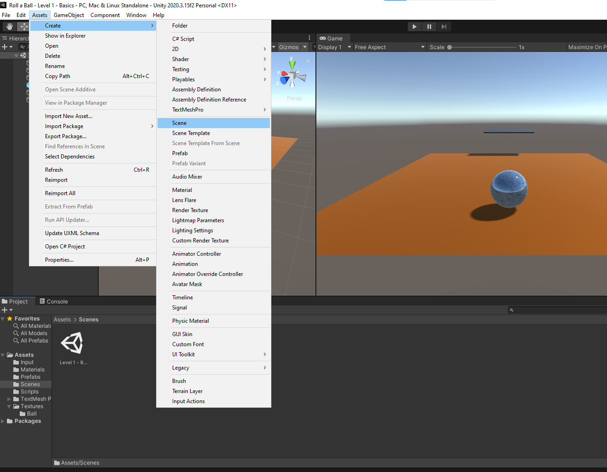
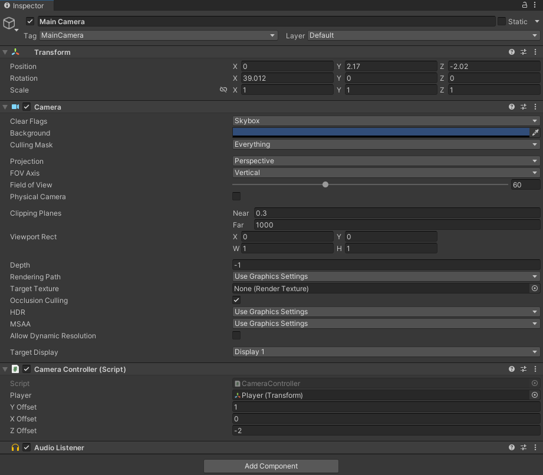

# Studio Beginner Tutorials - Roll a Ball Part 1
 
**Date**: October 10, 2022, 7:00 pm - 9:00 pm<br>
**Location**: Boelter 2760 <br>
**Instructors**: Ming Zhu, Matthew Workman, Ryan Vuong
 
## Resources
[Slides](https://tinyurl.com/Roll-A-Ball-part1-slides)<br>
[Video (From Last Year)](https://youtu.be/oB3sk4a3VkE)<br>
 
## Topics Covered
* Navigating Unity	
* Setting up a scene
* GameObject and Component fundamentals
* Introduction to scripting
* Cameras
* Colliders	
 
## What you'll need
* [Unity Hub](https://unity.com/download)
* [Unity 2021.3 (Any Unity 2021.3 version should work)](https://unity3d.com/unity/qa/lts-releases)
---
## Setting up a scene:
Start Unity Hub and click on **Projects** on the sidebar. Click on **New Project**, make sure **3D** is selected, choose where you want to save this project on your computer, name your project “Roll a ball” or something like that and click **Create Project**. It might take a few minutes for the project to be created but once it’s finished, it’ll open Unity. 
 
<br>
To create a new scene, first open the project and navigate to ```Assets->Create->Scene```. You can name your scene whatever you want.
 
## Navigating your workspace
<br>
There are several different Windows that should be visible by default. Here is a brief description of them.
 
**Hierarchy**: Displays every GameObject in a Scene. You can add GameObjects by right clicking on this window and selecting a type of GameObject. You can also search for specific GameObjects using the search bar above.<br>
 
**Scene**: The Scene view is what you can use to interact with GameObjects in the scene, such as cameras, lights, etc. Left-clicking on a GameObject in the Scene view will display its position and orientation in the world. The inspector will also be updated to display information about the object, unless it is locked.
 
**Game**: The Game view is rendered from the starting position of the Camera(s). When you enter *Play Mode* by clicking on the play button at the top middle of the Unity Window, you’ll be able to see how your game plays. You can still make changes while in *Play Mode*, but the changes are temporary.
 
**Inspector**: Shows information about a specific GameObject, such as its name, transform, and any components that are attached to it. You can have the inspector remain fixed by clicking the lock icon at the top right.
 
**Project**: A file structure that allows you to search where assets, prefabs, and scripts are located in the project. You can move items to different folders by dragging and placing them in other folders. You can also attach some items like scripts to a GameObject by dragging the item from the Project window to the GameObject in the Inspector.
 
**Console**: Displays warnings, errors, other messages generated by Unity. This view is very useful when reading ```Debug``` messages.
 
 
 
## Moving around the Scene view
The following are the default controls for navigating the scene view.
 
**Look around the scene**: RMB + moving mouse <br>
**Forwards, Left, Backwards, Right**:  RMB + (W,A,S,D) <br>
**Up** (in the y-direction): RMB + E <br>
**Down** (in the negative y-direction): RMB + Q <br>
**Orbit around a point**: Alt + Move left mouse button
 
 
 
## Toolbar
<br>
**Tools**: Move around the scene using the *Hand* tool, and edit GameObjects with the self-explanatory *Move*, *Rotate*, *Scale*, *Rectangular Transform*, and *Transform* tools.
 
**Play, Pause, Step**: Used in the Game view.
 
**Collab**: Launches Unity Collaborate, a way for teams to coordinate working on a Unity project. Found to the left of the Cloud button.
 
**Cloud**: Opens the Unity Services window.
 
 ---
 
## Creating a level
The ball will need a platform to roll on. We can create a plane by going to ```GameObject->3D Object->Plane``` at the top left. Reset its position so that it starts at the origin by clicking on the three dots next to the transform tab and select *Reset Position*. Under that plane, we need to add a `Rigidbody` component and a `Box Collider` component. Under `Rigidbody`, Check `Is Kinematic` and uncheck `Use Gravity`. `Rigidbody` is Unity’s built-in physics object, but we only need it to be an obstacle for the ball to roll on. Kinematic makes the object immovable to collisions, and Use Gravity applies gravity-based acceleration to the object.
 
### Creating materials
You can assign it a custom material by right-clicking in the *Project* window and selecting ```Create->Material```. Materials and shaders determine how a GameObject appears in a scene. To change the base color of a material, select the color next to the dropper. Alternatively, you can assign a texture map by clicking on the target icon next to *Albedo*. The other parameters are not necessary for the scope of this tutorial, but more info about each of the parameters can found [here](https://docs.unity3d.com/Manual/StandardShaderMaterialParameterAlbedoColor.html).
 
After creating a material, we can assign it to a GameObject by dragging it from the *Project* window and onto the GameObject in the *Scene* view. Alternatively, we can click on the GameObject in the hierarchy and assign it a material in the inspector. In the case for the newly created plane, click on the target icon under *Mesh Renderer* to view all applicable materials in the project.
 
### Creating Prefabs
A prefab is a special type of component that allows GameObjects to be saved in the project for reuse. Prefabs are useful when you intend to have multiple instances of the same GameObject in a scene and do not want to configure every GameObject with identical components. Additionally, any change made to a prefab asset will be reflected across all copies of that GameObject in a scene. You can create a prefab from an existing GameObject in a scene by dragging the name of the GameObject from the *Hierarchy* window to the *Project* window.
 
## Setting up the ball
<br>
To create a ball, which will be controlled by the player, create a 3D sphere
and add the following components in the inspector:
 
* **Sphere Collider**: Allows objects to collide with each other.<br>
* **Rigidbody**: Allows objects to be put under the control of Unity's physics engine. <br>
 
Finally, add a C# script component to the player, which will contain the following code:
```csharp
using System.Collections;
using System.Collections.Generic;
using UnityEngine;
 
public class PlayerController : MonoBehaviour
{
    // Component references
    Rigidbody rb;  // Unity's physics component
    SphereCollider col;  // Collision detection 
 
    [SerializeField] float speed = 5f;
    [SerializeField] float jumpHeight = 5f;
 
    // Start is called before the first frame update
    void Start()
    {
        // Get references to the components attached to the current GameObject
        rb = GetComponent<Rigidbody>();
        col = GetComponent<SphereCollider>();
    }
 
    // Update is called once per frame
    void Update()
    {
        // Unity's built-in input system commands
        float inputX = Input.GetAxis("Horizontal");  // Checks the keys associated with horizontal movement (A, D, leftarrow, rightarrow)
        float inputZ = Input.GetAxis("Vertical");  // Same as above comment except for vertical movement
 
        // Set the x & z velocity of the Rigidbody to correspond with our inputs while keeping the y velocity what it originally is.
        rb.velocity = new Vector3(inputX * speed, rb.velocity.y, inputZ * speed);
        
        if (Input.GetKeyDown(KeyCode.Space) && isGrounded())  // Jump if space is pressed and player is grounded
        {
            Jump();
        }
    }
 
    bool isGrounded()
    {
        ///
        /// distToGround gets the distance the raycast needs to travel in order to hit something just beneath itself.
        /// Since the raycast shoots from the center of our collider, we need it to travel the radius of the collider
        /// times any sort of size scaling on the y axis that could've happened to our GameObject. transform.lossyScale gets
        /// the absolute scaling of the object, and SphereCollider.radius gets the radius of our collider.
        ///
        float distToGround = col.radius * transform.lossyScale.y;  // This replaces the need to use a magic number
        ///
        /// Physics.Raycast() shoots a ray from a given position, at a given direction, for a given distance.
        /// It returns a boolean stating if it hits anything other than itself.
        ///
        return Physics.Raycast(transform.position, Vector3.down, distToGround);
    }
 
    void Jump()
    {
        // Set the y velocity to some positive value while keeping the x and z whatever they were originally
        rb.velocity = new Vector3(rb.velocity.x, jumpHeight, rb.velocity.z);
    }
}
 
 
```
## Setting up the camera
<br>
If you enter *Play Mode*, the ball should move when pressing the appropriate input controls, but the camera does not follow correctly. To resolve this, we need to add a camera controller script.<br>
 
```csharp
using System.Collections;
using System.Collections.Generic;
using UnityEngine;
 
public class CameraController : MonoBehaviour
{
    // Reference to the player's Transform (their position)
    [SerializeField] private Transform player;
 
    // Offsets for our camera
    [SerializeField] float yOffset = 1.5f;
    [SerializeField] float xOffset = 0f;
    [SerializeField] float zOffset = -2f;
 
    void Update()
    {
        ///
        /// So we want the camera to follow the player, but at a distance. To do this we set our
        /// camera's position to the player's position vector plus another vector containing an offset.
        ///
        transform.position = player.position + new Vector3(xOffset, yOffset, zOffset);        
    }
}
```
---
 
## Essential Links
- [Studio Discord](https://discord.com/invite/bBk2Mcw)
- [Linktree](https://linktr.ee/acmstudio)
- [ACM Membership Portal](https://members.uclaacm.com/)
## Additional Resources
- [Unity Documentation](https://docs.unity3d.com/Manual/index.html)
- [ACM Website](https://www.uclaacm.com/)
- [ACM Discord](https://discord.com/invite/eWmzKsY)
