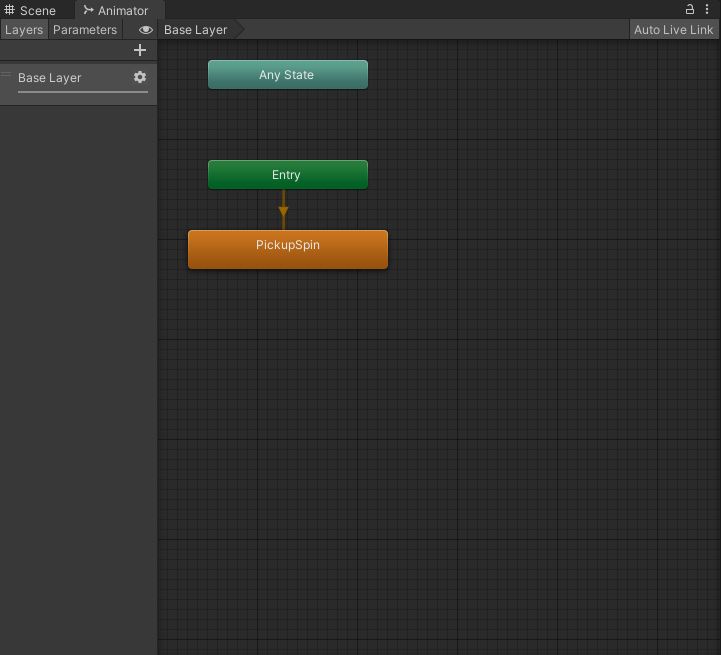
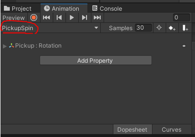
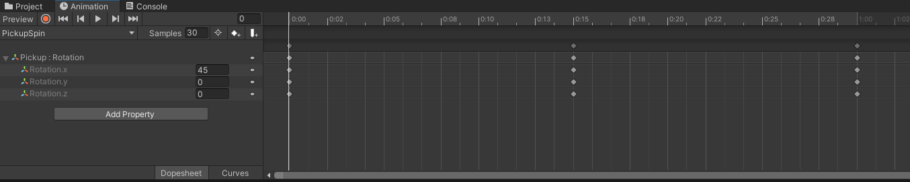
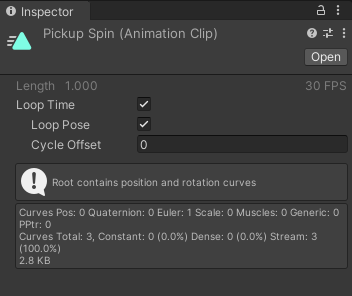
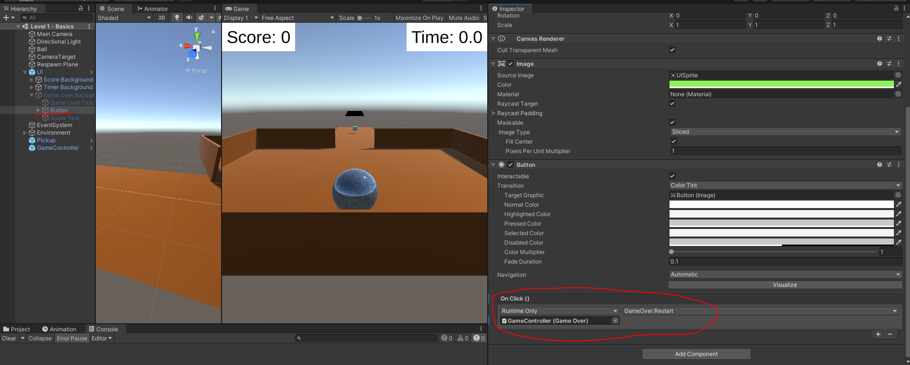

# Studio Beginner Tutorials - Roll a Ball Part 2
 
**Date**: October 19, 2021, 7:00 pm - 9:00 pm<br>
**Location**: Faraday Room 67-124 (Engineering IV)<br>
**Instructors**: Richard Cheng, Peter Sutarjo, Ryan Vuong
 
## Resources
[Slides](https://docs.google.com/presentation/d/1N__34gQRdCBV8gSB7huCgWJGKWnnMpdQAGUF3QjkW_k/edit?usp=sharing)<br>
[Video](https://youtu.be/AAJRsnKxLKk)<br>
[Unity Package for Part 1 (in case you missed it)](https://drive.google.com/file/d/1s9E6elKknWeoaUj-9DM1qlYfSwgamIsx/view?usp=sharing)
 
## Topics Covered
* UI Elements
* Adding items for player to pick up
* Switching scenes
 
## What you'll need
* [Unity Hub](https://unity.com/download)
* [Unity 2020.3.15f2](https://unity3d.com/unity/qa/lts-releases)
* [Git](https://git-scm.com/downloads)
---
## User interface
<br>
 
### Create a canvas
For this tutorial, we'll be making a simple UI which will display a score and a timer that counts down as shown above. To get started, create a `Canvas` by clicking `GameObject->UI->Canvas`. All UI objects need to be created as children of Canvases. Looking at the inspector, you may notice that a canvas is in the UI layer, separate from the 2D/3D scene. Every canvas game object has the following components:
* RectTransform: All UI elements have a RectTransform that has 2D coordinates instead of 3D coordinates.
* Canvas: The area in which UI elements appear within.
    * Render Mode: How the Canvas is rendered.
        * Overlay: Your UI is rendered on top of everything else on the screen. This mode is useful for most UI items, since only other UI objects can appear on in front of a canvas in this mode.
        * Camera: The UI is rendered a fixed distance from a camera. This is like overlay, except objects in your scene that are closer to the camera than your UI will appear in front of the UI.
        * World: The canvas is placed in your scene like any other game object, so you can have a canvas on a wall, for example.
    * Sort Order: Controls which canvas is drawn first. Larger numbers mean the canvas is drawn later, and therefore will appear in front of other canvases.
* Canvas Scaler: Used for controlling the overall scale and pixel density of UI elements in the Canvas. Contains settings that allow UI elements on a canvas to change size depending on screen size and resolution.
    * Constant Pixel Size: Your UI elements won’t scale based on the screen and resolution and will have the same size in pixels.
    * Constant Physical Size: Your UI elements will always have the same physical size on different screens. Most useful ensuring things like small buttons are easy to press on mobile screens.
    * Scale with Screen Size: Your UI elements will change size depending on the size of the screen and the resolution. You can match the height or width of the screen, or expand so that nothing is cut off by the edge of the screen, or shrink so that your UI always covers the entire screen (with cut off for certain resolutions).
* Graphic Raycaster: Determines if an element on a canvas has been hit (e.g. a button). For world canvases, you can change the settings to allow game objects in your scene to block raycasts to your UI.
 
For our canvas, we can go with a simple overlay canvas with constant pixel size. Then right click the canvas in the inspector and create a `UI->Image` to serve as the background for the text. Right click the image and select `UI->Text-TextMeshPro`. (Note: You should always use the TextMeshPro version of UI components, the regular versions look worse and are basically just there for backwards compatibility purposes.) Click on the `Text (TMP)` and change the text to “Score: 0”. Then, go to the Image and add a `VerticalLayoutGroup` (or a `HorizontalLayoutGroup`, both work for this purpose) and a `ContentSizeFitter` component. Make sure that everything next to “Control Child Size” and “Child Force Expand” is checked in the `LayoutGroup`. You should see that the white background now changes its size to match the text. You can also add a bit of padding so that there is a bit of space around the text. To position this image+text in the corner of our screen, go to the `RectTransform` of the image, and change the pivot to be X 0; Y 1. This tells Unity to calculate the position of the image based on its upper left corner. Then we move the image to the upper left corner by clicking the box in the `RectTransform` and selecting top-left, then changing PosX and PosY to 0.
 
Repeat these steps to create a timer text in the upper-right hand corner, except obviously select top-right instead of top-left, and change the X pivot to 1 to use the upper-right hand corner of the image as the pivot.
 
### Game Over Screen
For the game over screen, we can repeat the steps that were used to implement the timer and score UI elements; however, set the anchor for the image to stretch across the screen (hold alt and select the bottom right option). It’s children elements will be two `Text (TMP)`, which will be used to display “Game Over” and the Score. We’ll also add a `Button` element such that when it is clicked, it will restart the scene.
 
---
 
## Implementing a timer
To implement the timer, we can record the current time at `Start()` using `Time.time` and calculate the time elapsed after every frame in the `Update` function.
```csharp
public class TimerController : MonoBehaviour
{
    // Time to count down from
    [SerializeField] private int countdownTime;
 
    // When we started counting down
    private float startTime;
 
    // UI component for time
    [SerializeField] private TextMeshProUGUI countText;
 
    // UI Game Over component
    private GameOver gameOver;
 
    // Start is called before the first frame update
    void Start()
    {
        Time.timeScale = 1;
        startTime = Time.time;
        Debug.Assert(countText != null, "TextController missing TextMeshProUGUI component.");
        gameOver = (GameOver)GameObject.FindObjectOfType(typeof(GameOver));
    }
 
    void Update()
    {
        float timeElapsed = Time.time - startTime;
 
        int timeRemaining;
        if (timeElapsed < countdownTime)
        {
            timeRemaining = (int) (countdownTime - timeElapsed);
        }
        else
        {
            timeRemaining = 0; // Time remaining cannot go negative
            gameOver.DisplayFinalScore(ScoreController.score);
            Destroy(this);
        }
 
        countText.text = string.Format("{0:D2}:{1:D2}", timeRemaining / 60, timeRemaining % 60);
    }
}
```
 
## Implementing score
### Score controller
To keep track of score and update the text in the UI, we can create a script that will have a reference to the score text and a public static variable, which contains the value of the player's current score. A static variable means that there will only be one instance of it created at the start of the game that will remain over any scope. This allows for the score value to be preserved when switching scenes and scripts to modify its value during runtime. This will be shown next when implementing the pickups.
```csharp
using UnityEngine;
using TMPro;
 
public class ScoreController : MonoBehaviour
{
    public static int score = 0;
    public TextMeshProUGUI scoreText;
   
    // Update is called once per frame
    void Update()
    {
        scoreText.text = string.Format("Score: {0}", score);
    }
}
```
### Pickups
To implement the physical pickups themselves, let’s first create a 3D Cube by going to `GameObject->3D Object->Cube`. Next, let’s write a simple script that will increase the score whenever the player moves into it and then delete the pickup.
```csharp
public class Pickup : MonoBehaviour
{
   private void OnTriggerEnter(Collider other)
   {
       if (other.gameObject.tag == "Player")
       {
           ScoreController.score += 1;
           Destroy(this.gameObject);
       }
   }
}
```
Attach it to the cube and make sure the `Is Trigger` box is checked under the Box Collider component. Also check that the ball is correctly tagged as `Player` in the inspector. Note that we did not require an object of `ScoreController` in order to access the score variable because it was declared `public static`, only the type name was required to reference the variable.<br>
 
### Adding animation
Finally, we can add a simple animation (that doesn’t require any coding) to make the cube spin. First, add an animator component to the cube. The animator requires an `animator controller` asset. You can create the animator controller by right-clicking in the `Project` window and selecting `Animator Controller`. Don’t forget to assign the controller in the inspector.
 
<br>
 
Double-clicking the `Animator Controller`should bring up a window as shown above. This controller manages the transitions between animations and the various states of an animation using a **State Machine**. Currently the window should be blank because we have not added any animation clips as states yet. To create an animation clip for the pickup, select `Create New Clip…` in the Animation window as seen below.
 
<br>
 
Name and save the .anim clip. When you create a new animation clip, you should see the window. With the game object you want to animate still selected, Click **Add Property** and select `Transform->Rotation`. 
 
<br>
 
Above is the animation window. The *keyframes* (diamond shape keys on the timeline) will contain specific values of our rotation in the timeline. You can add keyframes by selecting the second button on the right next to `Samples` in the Animation window. Alternatively, you can press the record button to enable keyframe recording mode. In this mode, any modifications made to the object in the inspector will generate a keyframe depending on where the bar on the animation on the timeline is currently. The timeline displays units in `Seconds: Frame`. So for example, `1:10` means the 10th frame of the first second. Additionally, properties in the inspector will either be highlighted blue if they’re added as properties to an animation clip or red if keyframe recording mode is on. 
 
To have the cube rotate as seamlessly as possible, make sure that the rotational values between keyframes are evenly spaced. For example, since the sample rate for this animation is set to 30 frames, I have the y-rotation set to half of a full rotation at 0:15. Feel free to experiment with keyframes and the rotational values yourself to make a unique animation! Preview the animation by pressing spacebar or clicking on play button while cube is selected in the Scene View.
 
<br>
 
When you’re done, double click the animation clip and ensure **Loop Time** and **Loop Pose** are checked.<br>
 
## Scene Transitions
To move to other levels or stages in a game, it is important to know how to switch between scenes in Unity. To do this, we will need to create a new scene and name it “Level 2”. We can go ahead and make this new scene a copy of our previous level, so we can do less work. To do this, delete all the elements in the second scene (the default generated ones) and control (or command) click all the elements in scene 1 and paste them into the new scene. Now we should have two identical scenes.
 
To distinguish our new scene from the previous one, let’s change the colors of some walls. We can do this by making a new material and changing the color to something different, like green. By dragging the new material to the walls, we can recolor them. Now we should have two identical scenes but one has green walls (or whatever color you want).
 
To actually transition between scenes, there needs to be some kind of trigger or event that takes place which causes the change. We can make landing on a separate platform transport us to the next level. If we change back to our first scene and select the separate platform in the hierarchy, in the inspector we can go to the box collider and check the “Is Trigger” box. This will make it so that contact with the collider will cause a trigger to occur which can be accessed through scripting. 
 
We can now create a new script to manipulate this trigger to switch the player to our second scene. We can call this script something like “ToLevel2” and edit it to our liking. We can remove the start and update functions since we won’t be using them. Then at the top under “using UnityEngine;” we have to add the line “using UnityEngine.SceneManagement;” to enable scene switching. Next, within our ToLevel2 class we can add an OnTriggerEnter(Collider collider) function to dictate what happens when the trigger on our platform is activated. 
 
Within this function, we can call “SceneManager.LoadScene(“Level 1”)” with “Level 1” being whatever your first scene is named. In the end, the code will look something like:
 
```csharp
using UnityEngine.SceneManagement;
public class ToLevel2 : MonoBehaviour
{
   void OnTriggerEnter(Collider collider)
   {
       SceneManager.LoadScene("Level 2");
   }
}
```
 
We can now drag and attach this script onto our platform and try it out. It should transport you into your new scene. If you notice that the lighting in the second scene is darker compared to the first scene, despite everything being the same, it’s because each scene needs a unique lighting asset. To create this asset, go to your new scene then click Window -> Rendering -> Lighting -> Generate Lighting. 
 
<br>
 
If you are receiving errors when playing the game regarding inputs in the new scene, you have to go to “EventSystem” and enable the new input system.
 
Lastly, we don’t want our game to end here, so why don’t we switch scenes back to our first one after landing on the platform in our new scene. To do this, create a new script, name it something like “ToLevel1”, check “Is Trigger” on the platform’s box collider, and copy paste the previous script into it. Rename the class to “ToLevel1” and change the SceneManager.LoadScene line to “SceneManager.LoadScene(“Level 1”). Now we can drag this new script onto the platform in our second scene and run our game. It should be a constant loop of jumping onto the platforms back and forth. 
 
## Implement game over screen
To implement the game over screen, we’ll create a script called GameOver which will contain the following code:
```csharp
using UnityEngine;
using TMPro;
using UnityEngine.SceneManagement;

public class GameOver : MonoBehaviour
{
    // A reference to the "Score: ..." text element 
   public TextMeshProUGUI scoreText;

   // The game object containing the Game Over canvas
   public GameObject gameOverBG;

   // This function will be called when the timer runs out
   public void DisplayFinalScore(int score) 
   {
       gameOverBG.SetActive(true); 
       scoreText.text = string.Format("Score: {0}", score.ToString());
       ScoreController.score = 0; // Reset the static variable score
       Time.timeScale = 0; // Pause the game
   }
   
   // This function will be called when the Restart button is clicked
   public void Restart()
   {
       SceneManager.LoadScene("Level 1 - Basics");
   }
}
```
 we’ll need to make modifications to the ```TimeController``` script so that it calls ```DisplayFinalScore()``` as well.

```csharp
private void Update()
{
    // a reference to an object of type GameOver
    private GameOver gameOver

    // When the game starts, we'll look for an object of type GameOver. Since we
    // only expect to have one GameOver object, it is guaranteed that the same object
    // will be returned by the FindObjectOfType() method.
    void Start()
    {
        ...
        gameOver = (GameOver)GameObject.FindObjectOfType(typeof(GameOver));    
    }

    if (timeElapsed < countdownTime)
    {
        ...
    }
    else
    {   // if the timer is <= 0, up we want to display GameOver
        gameOver.DisplayFinalScore(ScoreController.score); 
    }
}
```
The last step is to assign the ```Restart``` function to the restart button as shown below.
<br>

---
## Essential Links
- [Studio Discord](https://discord.com/invite/bBk2Mcw)
- [Linktree](https://linktr.ee/acmstudio)
- [ACM Membership Portal](https://members.uclaacm.com/)
## Additional Resources
- [Unity Documentation](https://docs.unity3d.com/Manual/index.html)
- [ACM Website](https://www.uclaacm.com/)
- [ACM Discord](https://discord.com/invite/eWmzKsY)
 
 
 

