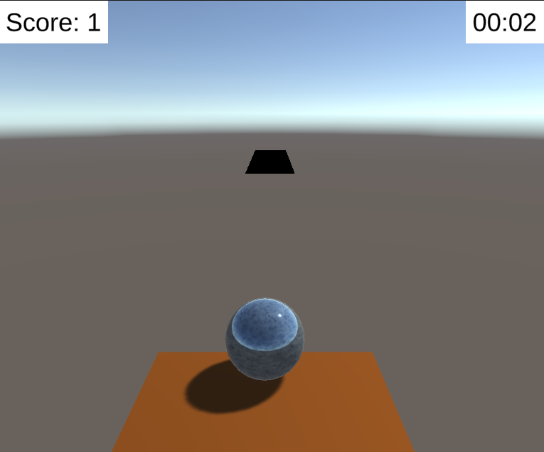
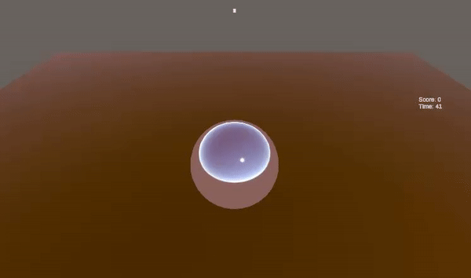
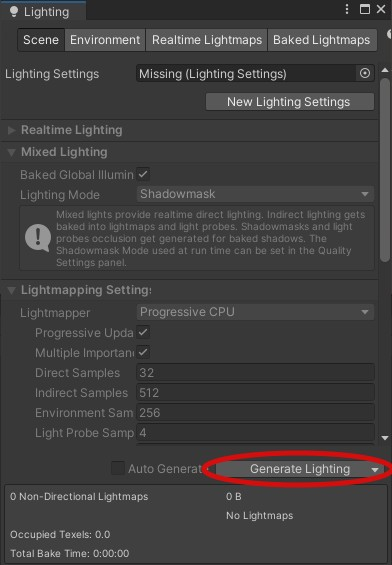

# Studio Beginner Tutorials - Roll a Ball Part 2
 
**Date**: October 17, 2022, 7:00 pm - 9:00 pm<br>
**Location**: Boelter 2760 <br>
**Instructors**: Ming Zhu, Ryan Vuong
 
## Resources
[Slides](https://tinyurl.com/Roll-a-Ball-pt2-slideshow)<br>
[Video (From Last Year)](https://youtu.be/AAJRsnKxLKk)<br>
[Unity Package for Part 1 (in case you missed it)](https://tinyurl.com/Roll-A-Ball-part2-pkg)
 
## Topics Covered
* UI Elements
* Adding items for player to pick up
* Respawning
* Switching scenes
 
## What you'll need
* [Unity Hub](https://unity.com/download)
* [Unity 2020.3.15f2](https://unity3d.com/unity/qa/lts-releases)
* [Git](https://git-scm.com/downloads)
---
## User interface
<br>
 
### GameManager
For this tutorial, we'll first make a simple UI which will display a score and a timer that counts down as shown above. For this, we will create a `GameManager` class to store our global variables. Global variable management may be slightly overkill here, but is prudent for scaling the project. We will attach this script to a GameObject in the scene, and any script requiring our score and timer will reference this single GameObject. The script is as follows:
 
```csharp
using System.Collections;
using System.Collections.Generic;
using UnityEngine;
 
public class GameManager : MonoBehaviour
{
    /// 
    /// So the intuition behind a GameManager is that all global variables are consolidated in an organized way.
    /// In our case, we only need to save the score and the time of the player, which could be stuck in any of
    /// the existing scripts but we use this as a template for organization such that your code is scalable. Do
    /// beware that you should only have one instance of the GameManager that every script would reference.
    /// 
 
    // Locally store our score
    float score = 0;
 
    public void AddScore(float amt)
    {
        score += amt;
    }
 
    public float GetScore()
    {
        return score;
    }
 
    public int GetTime()
    {
        ///
        /// Time.timeSinceLevelLoad will give the seconds elapsed since the current game scene has been loaded. 
        /// In other words, reloading the scene resets this number. We cast to integer (originally returns float)
        /// so it counts up by whole seconds.
        ///  
 
        return (int) Time.timeSinceLevelLoad;
    }
}
```
 
With the script written, right click the Hierarchy to create an empty GameObject and attach the GameManager script to it. Any reference to GameManager should now be directed to this GameObject.
 
### Create a canvas
Create a `Canvas` by clicking `GameObject->UI->Canvas`. All UI objects need to be created as children of Canvases. Looking at the inspector, you may notice that a canvas is in the UI layer, separate from the 2D/3D scene. 
 
#### The following section describes some useful information on UI elements & canvasses written by alum officer Richard, though it is unnecessary to reproduce the tutorial content.

Every canvas game object has the following components:
* RectTransform: All UI elements have a RectTransform that has 2D coordinates instead of 3D coordinates.
* Canvas: The area in which UI elements appear within.
    * Render Mode: How the Canvas is rendered.
        * Overlay: Your UI is rendered on top of everything else on the screen. This mode is useful for most UI items, since only other UI objects can appear on in front of a canvas in this mode.
        * Camera: The UI is rendered a fixed distance from a camera. This is like overlay, except objects in your scene that are closer to the camera than your UI will appear in front of the UI.
        * World: The canvas is placed in your scene like any other game object, so you can have a canvas on a wall, for example.
    * Sort Order: Controls which canvas is drawn first. Larger numbers mean the canvas is drawn later, and therefore will appear in front of other canvases.
* Canvas Scaler: Used for controlling the overall scale and pixel density of UI elements in the Canvas. Contains settings that allow UI elements on a canvas to change size depending on screen size and resolution.
    * Constant Pixel Size: Your UI elements won’t scale based on the screen and resolution and will have the same size in pixels.
    * Constant Physical Size: Your UI elements will always have the same physical size on different screens. Most useful ensuring things like small buttons are easy to press on mobile screens.
    * Scale with Screen Size: Your UI elements will change size depending on the size of the screen and the resolution. You can match the height or width of the screen, or expand so that nothing is cut off by the edge of the screen, or shrink so that your UI always covers the entire screen (with cut off for certain resolutions).
* Graphic Raycaster: Determines if an element on a canvas has been hit (e.g. a button). For world canvases, you can change the settings to allow game objects in your scene to block raycasts to your UI.
 
#### Here resumes content to recreate the tutorial.
For our UI, right click the canvas and select `UI->Text-TextMeshPro`. (Note: You should always use the TextMeshPro version of UI components, the regular versions look worse and are basically just there for backwards compatibility purposes.). This should add a “Text(TMP)” object to your scene, attached under the Canvas. For our canvas, we keep the Canvas component’s Render Mode option to “Screen Space - Overlay” and set Canvas Scaler’s UI Scale Mode to “Scale With Screen Size”, then set the Reference Resolution to x:1600 by y:900 (1600x900 is a common set of dimensions fro screen size so we use that). Now we will implement the rest of the UI through code:
```csharp
using System.Collections;
using System.Collections.Generic;
using UnityEngine;
using TMPro;  // Extra import for TextMeshPro
 
public class UIController : MonoBehaviour
{
    /// 
    /// This script controls the UI display.
    /// 
 
    [SerializeField] GameManager gm;  // Our game manager reference
    [SerializeField] TMP_Text txt;  // The text element that we are modifying
 
    void Update()
    {
        /// 
        /// So we are displaying the score of the player as well as the time that they have been on the level.
        /// All we have to do is set the text of the text display to the string that we need. 
        ///
        string display = "Score: " + gm.GetScore() + "\nTime: " + gm.GetTime();
        txt.text = display;
    }
}
```
 
Drag the script onto the Canvas, and drag in the GameManager object we made previously and the Text(TMP) object under the Canvas into their respective `SerializeField`s.
 
### Pickups
To implement the physical pickups themselves, let’s first create a 3D Cube by going to `GameObject->3D Object->Cube`. Next, let’s write a simple script that will increase the score whenever the player moves into it and then delete the pickup. Optionally, there is code that makes the player jump when they pick up a collectible. The full commented script is as follows:
 
```csharp
using System.Collections;
using System.Collections.Generic;
using UnityEngine;
 
public class Collectible : MonoBehaviour
{
    /// 
    /// This script controls the behaviour for collectibles, which we would save as a prefab. Because of this, we can't use
    /// SerializeFields to pass in references since we want to be able to quickly duplicate a lot of these (or even instantiate
    /// them dynamically with scripts!). As such, we will reference other GameObjects through code
    /// 
    GameManager gm;
 
    void Start()
    {
        // Searches your scene hierarchy for a GameManager component, returning a reference of the first that it finds.
        gm = FindObjectOfType<GameManager>();
    }
 
    private void OnTriggerEnter(Collider collision)
    {
        // Adds score for collecting the object
        gm.AddScore(5f);
 
        /// 
        /// The following we will optionally cover in the tutorial. We want the player to jump after picking up the object.
        /// To do this, first make sure that Jump() under PlayerController is made a public function (so this script can actually call it).
        /// We will grab a reference to PlayerController through the collider (we don't need to check of the colliding object
        /// is the player since only the player can move to collide with this object). To do so, we first reference the GameObject the 
        /// collider is attached to, then reference the PlayerController attached to the GameObject, and then call Jump().
        ///
 
        // OPTIONAL: make the player jump again from picking up the object
        collision.gameObject.GetComponent<PlayerController>().Jump();
 
        // Delete the GameObject that this script is attached to
        Destroy(gameObject);
    }
}
```
Attach it to the cube and make sure the `Is Trigger` box is checked under the Box Collider component. Finally, drag the cube into the Project window, under your Assets folder. This will create a **Prefab**, which is a template for generating duplicates of the same GameObject. Now, you can drag the newly created prefab from the assets folder into your hierarchy, and editing the prefab will update all its instances in the scene.

<br>
<br>

## Respawning the Player
It’s important to respawn the player if the player falls off the edge so that we aren’t falling into the abyss forever. To do this, we can start by editing our PlayerController.cs file (or whichever file that’s used to control the player’s movement through inputs) to include a `Respawn` function. 
 
```csharp
private void Respawn()
    {
        transform.position = startPos;
        rb.velocity = Vector3.zero;
    }
```
 
This function sets the ball's position to the position it was at the start of the game and stops it from moving. First we have to define this start position though. We do so by defining a new Vector3 `startPos` towards the beginning of the PlayerController file and initializing it in the start function. 
 
```csharp
    Vector3 startPos;
 
    void Start()
    {
        // Save starting position to use for respawning
        startPos = transform.position;
	…
```
 
Lastly, we want to call this respawn function after the ball has been falling for too long. An easy way to do this is to check the position of the ball and if it’s below some threshold, we can call `Respawn`.
 
```csharp
    if (transform.position.y < -20f)
            Respawn();
```
 
## Scene Transitions
To move to other levels or stages in a game, it is important to know how to switch between scenes in Unity. To do this, we will need to create a new scene and name it “Level 2”. We can go ahead and make this new scene a copy of our previous level, so we can do less work. To do this, simply copy and paste the level we have into the “Scenes” folder.
 
To distinguish our new scene from the previous one, let’s change the colors of the plane. We can do this by making a new material and changing the color to something different, like green. By dragging the new material to the walls, we can recolor them. Now we should have two identical scenes but one has a green floor(or whatever color you want).
 
To actually transition between scenes, there needs to be some kind of trigger or event that takes place which causes the change. We can make landing on a separate platform transport us to the next level. If we change back to our first scene and create a new plane, in the inspector we can go to the collider and check the “Is Trigger” box. This will make it so that contact with the collider will cause a trigger to occur which can be accessed through scripting.
 
We can now create a new script to manipulate this trigger to switch the player to our second scene. We can call this script something like “ToLevel2” and edit it to our liking. We can remove the start and update functions since we won’t be using them. Then at the top under “using UnityEngine;” we have to add the line `using UnityEngine.SceneManagement;` to enable scene switching. Next, within our ToLevel2 class we can add an OnTriggerEnter(Collider collider) function to dictate what happens when the trigger on our platform is activated.
 
Within this function, we can call `SceneManager.LoadScene(“Level2”)` with `Level 2` being whatever your first scene is named. In the end, the code will look something like:
 
```csharp
using UnityEngine.SceneManagement;
public class ToLevel2 : MonoBehaviour
{
   void OnTriggerEnter(Collider collider)
   {
       SceneManager.LoadScene("Level2");
   }
}
```
 
We can now drag and attach this script onto our platform and try it out. It should transport you into your new scene. If you notice that the lighting in the second scene is darker compared to the first scene, despite everything being the same, it’s because each scene needs a unique lighting asset. To create this asset, go to your new scene then click Window -> Rendering -> Lighting -> Generate Lighting.
 
<br>
 ## Essential Links
- [Studio Discord](https://discord.com/invite/bBk2Mcw)
- [Linktree](https://linktr.ee/acmstudio)
- [ACM Membership Portal](https://members.uclaacm.com/)
## Additional Resources
- [Unity Documentation](https://docs.unity3d.com/Manual/index.html)
- [ACM Website](https://www.uclaacm.com/)
- [ACM Discord](https://discord.com/invite/eWmzKsY)
 
