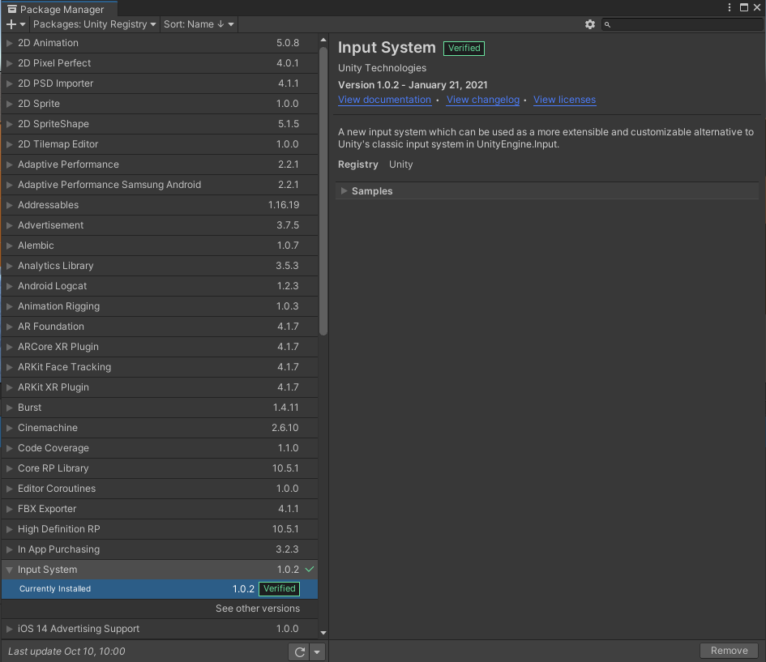
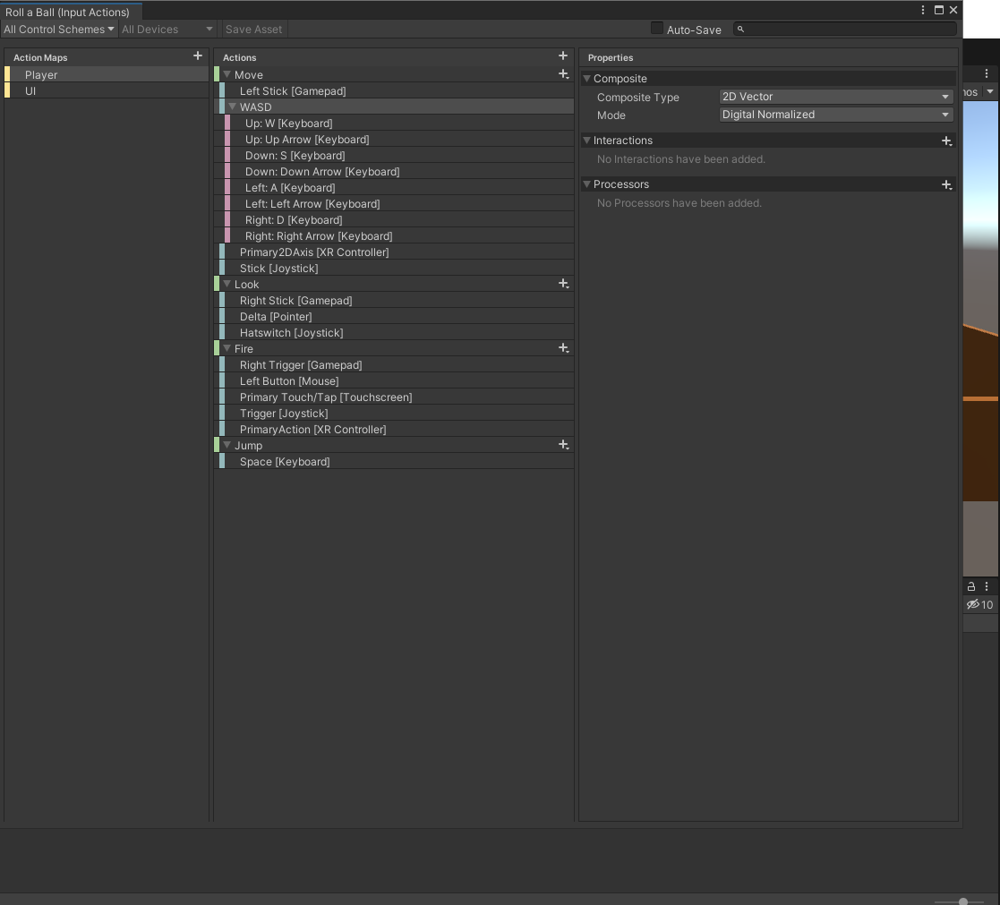
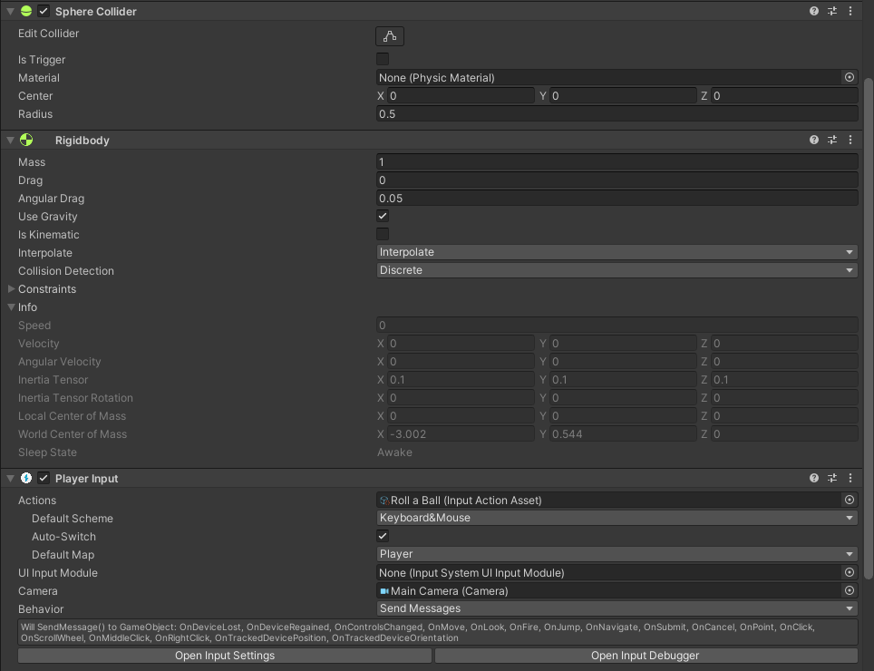
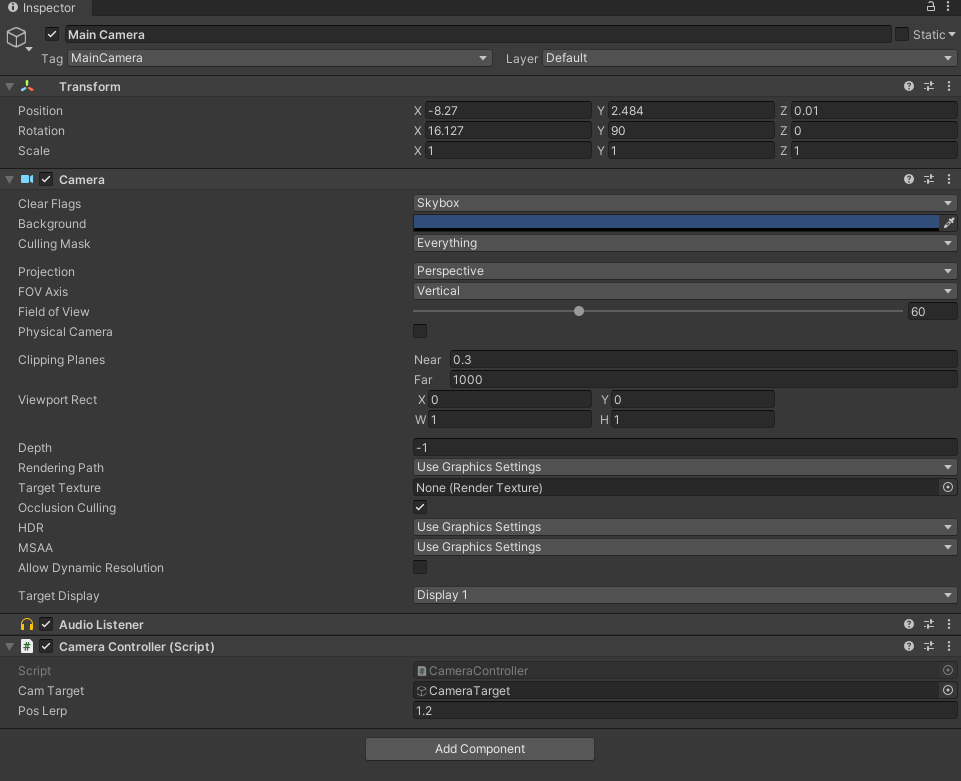

# Studio Beginner Tutorials - Roll a Ball Part 1
 
**Date**: October 12, 2021<br>
**Location**: Faraday Room (ENG IV)<br>
**Instructors**: Richard Cheng, Ray Hsiao, Peter Sutarjo
 
## Resources
[Slides](https://docs.google.com/presentation/d/1jJV7GuUdXfJm5YG7ruv3OJBBqoY1VfJ1LB5PPNmsd1w/edit?usp=sharing)<br>
[Video]()<br>
 
## Topics Covered
* Setting up a scene
* GameObject and Component fundamentals
* Using an input system
* Introduction to Scripting
* Cameras
* Colliders
 
## What you'll need
* [Unity Hub](https://unity.com/download)
* [Unity 2020.3.15f2](https://unity3d.com/unity/qa/lts-releases)
* [Git](https://git-scm.com/downloads)
---
## Setting up a scene:
Start Unity Hub and click on **Projects** on the sidebar. Click on Add and select the folder named Roll a Ball to add Unity to your list of projects. If the project is greyed out then make sure that you have selected Unity 2020.3.15f2 as your project version.
 
<br>
To create a new scene, first open the project and navigate to ```Assets->Create->Scene```. You can name your scene whatever you want.
 
## Navigating your workspace
<br>
There are several different Windows that should be visible by default. Here is a brief description of them.
 
**Hierarchy**: Displays every GameObject in a Scene. You can add GameObjects by right clicking on this window and selecting a type of GameObject. You can also search for specific GameObjects using the search bar above.<br>
 
**Scene**: The Scene view is what you can use to interact with GameObjects in the scene, such as cameras, lights, etc. Left-clicking on a GameObject in the Scene view will display its position and orientation in the world. The inspector will also be updated to display information about the object, unless it is locked.
 
**Game**: The Game view is rendered from the Camera’s(s) starting position. When you enter *Play Mode* by clicking on the play button at the top middle of the Unity Window, you’ll be able to see how your game plays. You can still make changes while in *Play Mode*, but the changes are temporary.
 
**Inspector**: Shows information about a specific GameObject, such as its name, transform, and any components that are attached to it. You can have the inspector remain fixed by clicking the lock icon at the top right.
 
**Project**: A file structure that allows you to search where assets, prefabs, and scripts are located in the project. You can move items to different folders by dragging and placing them in other folders. You can also attach some items like scripts to a GameObject by 
 
**Console**: Displays warnings, errors, other messages generated by Unity. This view is very useful when reading ```Debug``` messages.
 

 
## Moving around the Scene view
The following are the default controls for navigating the scene view.
 
**Look around the scene**: RMB + moving mouse <br>
**Forwards, Left, Backwards, Right**:  RMB + (W,A,S,D) <br>
**Up** (in the y-direction): RMB + E <br>
**Down** (in the negative y-direction): RMB + Q <br>
**Orbit around a point**: Alt + Move left mouse button
 

 
## Toolbar
<br>
**Tools**: Move around the scene using the *Hand* tool, and edit GameObjects with the self-explanatory *Move*, *Rotate*, *Scale*, *Rectangular Transform*, and *Transform* tools.
 
**Play, Pause, Step**: Used in the Game view.
 
**Collab**: Launches Unity Collaborate, a way for teams to coordinate working on a Unity project. Found to the left of the Cloud button.
 
**Cloud**: Opens the Unity Services window.

 ---

## Setting up an input system
<br>
To ensure that you have the new input system installed (not the legacy version), go to ```Window->Package Manager->Input System```. If you don’t see the Input System package, verify that you have *Packages:Unity Packages* selected on the top left of the Package Manager. If there is a green checkmark next to the Input System, then it is correctly installed.
 
<br>
Next, create an Input Actions Asset by going to ```Create->Input Actions```. Double-clicking on this asset will bring up several panels, which you can use to configure control schemes for different controllers. For this tutorial, we’ll be using the default generated control scheme as shown above.
 
## Creating a level
The ball will need a platform to roll on. We can create a plane by going to ```GameObject->3D Object->Plane``` at the top left. Reset its position so that it starts at the origin by clicking on the three dots next to the transform tab and select *Reset Position*.

### Creating materials
You can assign it a custom material by right-clicking in the *Project* window and selecting ```Create->Material```. Materials and shaders determine how a GameObject appears in a scene. To change the base color of a material, select the color next to the dropper. Alternatively, you can assign a texture map by clicking on the target icon next to *Albedo*. The other parameters are not necessary for the scope of this tutorial, but more info about each of the parameters can found [here](https://docs.unity3d.com/Manual/StandardShaderMaterialParameterAlbedoColor.html).

After creating a material, we can assign it to a GameObject by dragging it from the *Project* window and onto the GameObject in the *Scene* view. Alternatively, we can click on the GameObject in the hierarchy and assign it a material in the inspector. In the case for the newly created plane, click on the target icon under *Mesh Renderer* to view all applicable materials in the project.

### Creating Prefabs
A prefab is a special type of component that allows GameObjects to be saved in the project for reuse. Prefabs are useful when you intend to have multiple instances of the same GameObject in a scene and do not want to configure every GameObject with identical components. Additionally, any change made to a prefab asset will be reflected across all copies of that GameObject in a scene. You can create a prefab from an existing GameObject in a scene by dragging the name of the GameObject from the *Hierarchy* window to the *Project* window.

## Setting up the ball
<br>
To create a ball, which will be controlled by the player, create a 3D sphere
and add the following components in the inspector:

* **Sphere Collider**: Allows objects to collide with each other.<br>
* **Rigidbody**: Allows objects to be put under the control of Unity's physics engine. <br>
* **Player Input**: Represents a separate player or user. Multiple PlayerInput instances can exist at the same time (though not on the same GameObject) to represent local multiplayer setups. Assign the Input Actions Asset under actions. <br>

Finally, add a C# script component to the player, which will contain the following code:
```csharp
using System.Collections;
using System.Collections.Generic;
using UnityEngine;
using UnityEngine.InputSystem;

public class PlayerController : MonoBehaviour
{
    [SerializeField] float speed = 10;
    [SerializeField] float jumpForce = 500f;
    
    // Holds a reference to a rigid body component of the game object is attached to
    private Rigidbody rb;

    private float movX;
    private float movY;

    // Starting position of the ball
    private Vector3 startingPosition;

    // You can initialize member variables at declaration
    private int touchingGround = 0;

    // Start is called before the first frame update
    void Start()
    {
        // Make sure you attach rigid body to the ball first
        rb = GetComponent<Rigidbody>();
        startingPosition = transform.position;
    }

    // Detects event and then calls Update
    void OnMove(InputValue movementVal)
    {
        // Horizontal movement
        Vector2 movementVector = movementVal.Get<Vector2>();

        movX = movementVector.x;
        movY = movementVector.y;
    }

    // onCollisionEnter is called when you start colliding with an object
    void OnCollisionEnter(Collision collision)
    {
    	if (collision.gameObject.tag == "Ground")
    	{
    		touchingGround++;
    	}
    }

    // onColisionExit is called when you stop colliding with an object
    void OnCollisionExit(Collision collision)
    {
    	if (collision.gameObject.tag == "Ground")
    	{
    		touchingGround--;
    	}
    }

    void OnTriggerEnter(Collider collider)
    {
    	if (collider.gameObject.name == "Respawn Plane")
    	{
    		// Respawn ball at starting position
    		transform.position = startingPosition;

    		// Also stop ball from moving & rotating at respawn
    		rb.velocity = Vector3.zero;
    		rb.angularVelocity = Vector3.zero;
    	}
    }

    // Only jump if you are touching the ground
    void OnJump()
    {
    	if (touchingGround > 0)
        	rb.AddForce(Vector3.up*jumpForce);
    }

    void FixedUpdate()
    {
        // We create a Vector3 using a constructor, passing the x, y values.
        // movY value is the third argument since the xz plane represents our floor.
        Vector3 movement = new Vector3(movX, 0.0f, movY);

        Vector3 cameraForward = Vector3.ProjectOnPlane(Camera.main.transform.forward, Vector3.up);
        Quaternion rotationCamera = Quaternion.LookRotation(cameraForward, Vector3.up);

        rb.AddForce(rotationCamera * movement * speed);
    }    
}
```
## Setting up the camera
<br>
If you enter *Play Mode*, the ball should move when pressing the appropriate input controls, but the camera does not follow correctly. To resolve this, we need to add a camera controller script.<br> 

```csharp
using System.Collections;
using System.Collections.Generic;
using UnityEngine;

public class CameraController : MonoBehaviour
{
    public GameObject camTarget;
    public float posLerp = 0.04f;

    // LateUpdate is called once per frame after all update functions have been called.
    // This method is useful to order script execution.
    // We use LateUpdate because we want to update the camera's position only after all tracked objects have been moved.
    void LateUpdate()
    {
        // Lerp means linear interpolation, which returns a value betwteen two points in a linear scale.
        // In this case, we use lerp so that the camera changes its position in a fixed amount of time, resulting in smooth movement.
        transform.position = Vector3.Lerp(transform.position, camTarget.transform.position, posLerp);
    }
}
```
---

## Essential Links
- [Studio Discord](https://discord.com/invite/bBk2Mcw)
- [Linktree](https://linktr.ee/acmstudio)
- [ACM Membership Portal](https://members.uclaacm.com/)
## Additional Resources
- [Unity Documentation](https://docs.unity3d.com/Manual/index.html)
- [ACM Website](https://www.uclaacm.com/)
- [ACM Discord](https://discord.com/invite/eWmzKsY)
 
 
