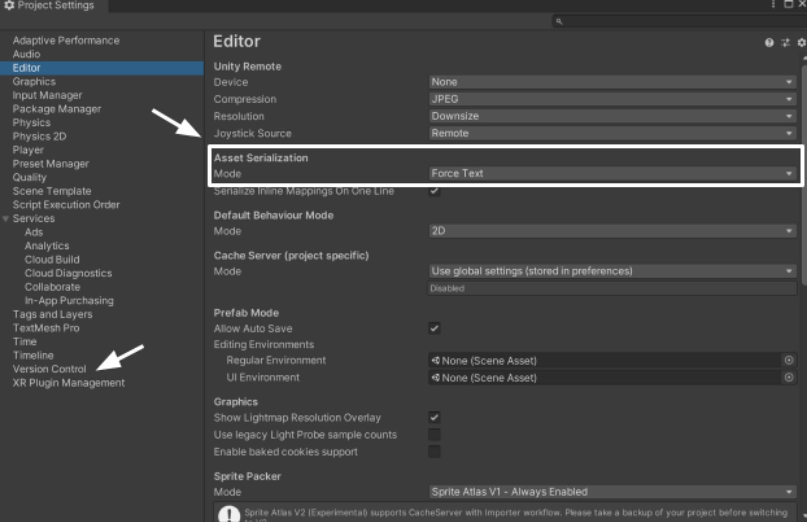
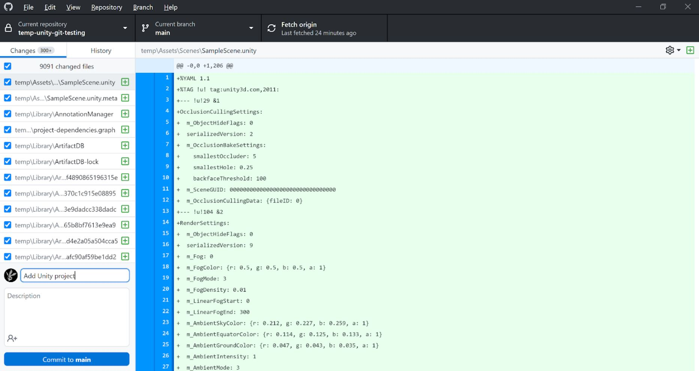
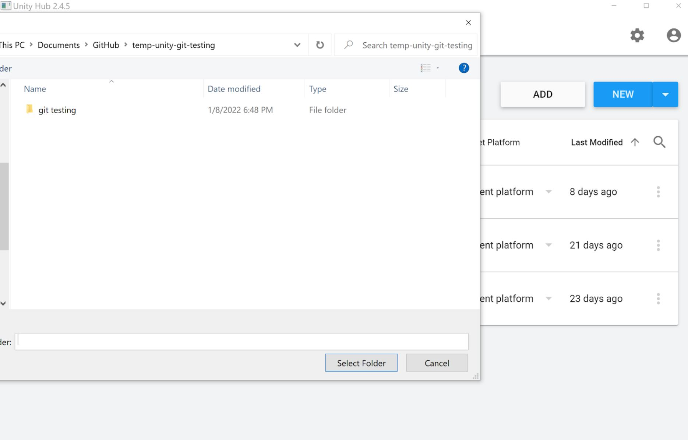

# Version Control in Game Projects: Using Unity with GitHub Desktop
 
**Contributors**: Ray Hsiao, Richard Cheng, Brandon Truong
 
## Resources
- [Git documentation](https://git-scm.com/doc) for diving deeper into Git
 
## Topics Covered
* Why version control?
* Starting a project
* Joining a project
* Working on a project
 
## What you'll need
* [Unity Hub](https://unity.com/download)
* [Unity 2020.3.15f2](https://unity3d.com/unity/qa/lts-releases)
* [Git](https://git-scm.com/downloads)
* A [GitHub account](https://github.com/)
* [GitHub Desktop](https://desktop.github.com/), signed in with your GitHub account
* *NOT* the GitHub for Unity extension

---
## Why version control?

Version control allows developers to keep track of changes, compare different versions, revert to previous versions as needed. This is already extremely useful even for solo developers! Version control also allows multiple people to work on the same project. Each person works on their own local version of the project while the main project is hosted elsewhere.

---

## Starting a project

### Create a new repository in GitHub
Write an apt name and description for the repository (hereinafter repo). Add the README, the Unity .gitignore, and/or license. There are problems with GitHub's default Unity .gitignore, which will be covered later.

### Clone the repo to your local machine
On the GitHub webpage for your repo, click the green `Code` button and `Open in GitHub Desktop` from the dropdown.

If that doesn't work, copy the [repo url].git from the dropdown. On GitHub Desktop, either click `File` then `Clone repository...` from the dropdown menu or CTRL+SHIFT+O, and clone by URL, pasting in the link you copied.

Make sure you can find the repo later on! By default, it will be saved in the GitHub folder, but if you're having trouble finding it, use CTRL+SHIFT+F to open the file explorer within GitHub Desktop.
 
### Create a Unity project and configure Unity for version control
Create a new project in Unity **located in the repo folder**. Open it to configure Unity for version control. To do so, open the editor settings window by clicking `Edit` then `Project Settings` from the dropdown menu. Under `Asset Serialization` in `Editor`, set the `Mode` to "Force Text". Under `Version Control` and set the `Mode` to "Visible Meta Files".

Save your Unity project to save the changes, which are reflected in the editor settings file `ProjectSettings/EditorSettings.asset` as the lines `m_ExternalVersionControlSupport: Visible Meta Files` and `m_SerializationMode: 2`.

### Ensure the .gitignore works properly

#### GitHub's default .gitignore
If you create the repo with the Unity .gitignore from GitHub's dropdown menu, the .gitignore will not be the [latest version](https://github.com/github/gitignore/blob/main/Unity.gitignore). The latest version is linked in the out-of-date .gitignore as well. Make sure to edit the .gitignore to match the latest version, and you may want to add other files to the .gitignore, such as the .DS_Store files generated by Macs and .vscode folder generated by Visual Studio (although you may want to keep that one if you want to enforce certain shared settings across VS users).

#### Correct path
Note that the top of the .gitignore says "This .gitignore file should be placed at the root of your Unity project directory"! This is because the slashes in front of `/[Ll]ibrary/`, `/[Tt]emp/`, etc. indicate that these folders are found within the same folder as the .gitignore. Right now, the .gitignore is outside of your Unity project folder, so if you try to push your changes, you notice that there are MANY MANY changed files that the .gitignore should handle! Don't make that commit!

To correct this, move your .gitignore into the Unity project folder. Notice how the number of changes drops down to a much more reasonable number! This is because the .gitignore is working.

(I'm recommending this method because I find it to be the most straightforward. One alternate method is to remove the slashes in front of `/[Ll]ibrary/`, `/[Tt]emp/`, etc. in the .gitignore. That way, you don't need to move the .gitignore into the Unity project folder. Another alternate method is to copy all of the git files from the repo into the Unity project folder.)

### Commit and push your changes
On GitHub Desktop, write a descriptive and concise commit title and description if necessary, then hit the blue commit button.

### Add contributors
On the webpage for the repo, under `Settings`, go to `Manage Access` and `Invite collaborators`. You will need either the GitHub usernames or email addresses of those you wish to add to your project. 

---

## Joining an existing project

### Get added to the repo
Give your GitHub username or email address to the repo's owner. You should receive an email with an invitation to collaborate - make sure to accept it!

### Clone the repo to your local machine
On the GitHub webpage for your repo, click the green `Code` button and `Open in GitHub Desktop` from the dropdown.

If that doesn't work, copy the [repo url].git from the dropdown. On GitHub Desktop, either click `File` then `Clone repository...` from the dropdown menu or CTRL+SHIFT+O, and clone by URL, pasting in the link you copied.

Make sure you can find the repo later on! By default, it will be saved in the GitHub folder, but if you're having trouble finding it, use CTRL+SHIFT+F to open the file explorer within GitHub Desktop.

### Add the project in Unity Hub
Click the "Add" button and find your folder in the file explorer. Reread the last paragraph in the previous section if you can't find your project.

---

## Working on a project

### Preparation

A good reference for best practices is [Richard's Programming Essentials tutorial](https://github.com/uclaacm/studio-advanced-tutorials-f21/tree/main/Programming%20Essentials) (link will probably be out of date in the future)!

Establish standards (naming, folders, etc.) ASAP. Modularize code as much as possible, for example, separate character movement from character attacks. Divide work such that people are working independently of one another, unless it's intended that people are working on the same thing.

### Git stuff

#### Branches

Work in branches, and make a new branch for each feature. The GitHub documentation [About branches](https://docs.github.com/en/pull-requests/collaborating-with-pull-requests/proposing-changes-to-your-work-with-pull-requests/about-branches) provides a good explanation of how branching works.

#### Commits and pushing to remote

A commit is a snapshot of the current state of the project, and with each commit you make, write commit messages such that someone other than you (or your future self) will be able to understand it. Feel free to make commits as often as needed, and err towards too many rather than too few

Once you're ready to push your commits to the remote, make sure to pull any changes first. 

#### Code review

If other people aren't present to discuss your changes synchronously, make a pull request on GitHub so someone can look at it later.

##### Resolving merge conflicts

How the merge conflict is handled depends on what is conflicting.

For example, if the issue is with a script, manually merge the code such that all of the intended changes are included without conflict. If you don't know how to do this, reference the GitHub documentation for [Resolving a merge conflict on GitHub](https://docs.github.com/en/pull-requests/collaborating-with-pull-requests/addressing-merge-conflicts/resolving-a-merge-conflict-on-github).

If the issue is with an asset or scene, communicate with others who worked on the same asset/scene and determine which version is more "up to date." Some of the work may still be lost in the process and have to be redone. Changes involving TextMeshPro font assets can generally be ignored unless you're adding in special characters to the font (such as foreign language characters).

Note: This is not a comprehensive list of potential merge conflicts.

---

## Closing notes

While I personally think working with Git through GitHub Desktop rather than on the command line interface (CLI) makes most sense for Unity, I would recommend that you familiarize yourself with using Git on the CLI to understand how Git works better.

---

## Essential Links
- [Studio Discord](https://discord.com/invite/bBk2Mcw)
- [Linktree](https://linktr.ee/acmstudio)
- [ACM Membership Portal](https://members.uclaacm.com/)
## Additional Resources
- [Unity Documentation](https://docs.unity3d.com/Manual/index.html)
- [ACM Website](https://www.uclaacm.com/)
- [ACM Discord](https://discord.com/invite/eWmzKsY)
 
 

