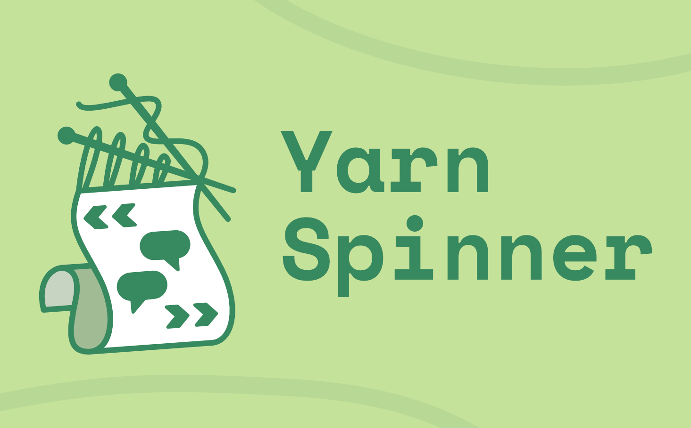
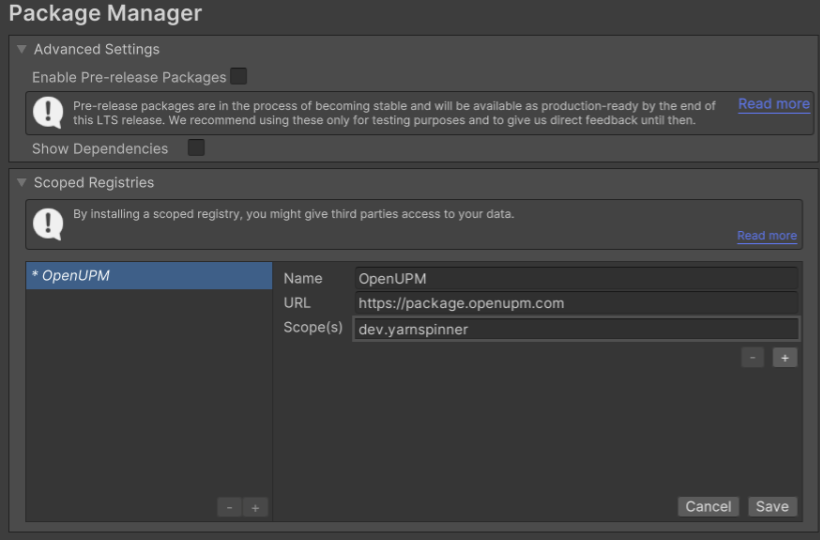
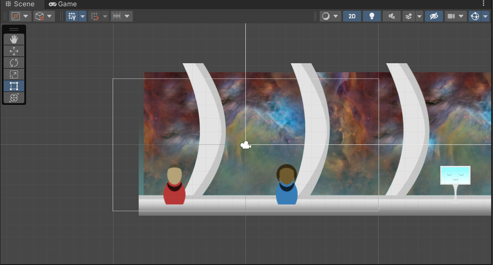
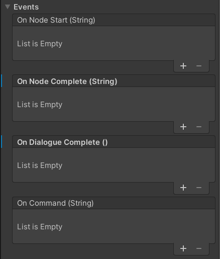
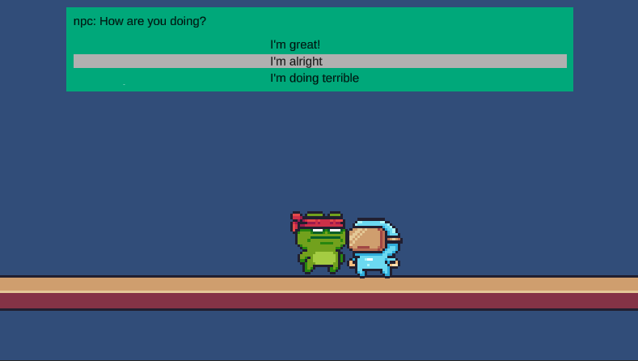
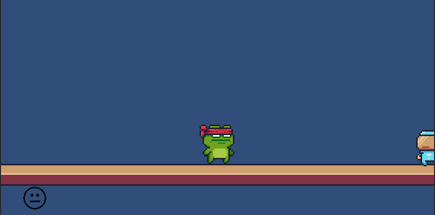

# Studio Beginner Tutorials - Yarnspinner: Narrative and Dialogue
 
**Date**: November 7, 2022, 7:00 pm - 9:00 pm<br>
**Location**: Boelter 2760 <br>
**Instructors**: Connor Daly
 
## Resources
[Slides](https://docs.google.com/presentation/d/1s0GM1ZaPMfFGZEiMaICFHvSrDr1EbyZttKFEgR63GrA/edit?usp=sharing)<br>
[Unity Skeleton package](yarnspinner_skeleton.unitypackage)
 
## Topics Covered
* Overview of Yarnspinner
* Add Yarnspinner to game  
* Yarnspinner Example 
* Very basic writing dialogue just basically adding character name, a choice and doing a command and  maybe switch node 
* coding a yarn command 
* editing lineview 
* editing option List view

 
## What you'll need
* [Unity Hub](https://unity.com/download)
* [Unity 2021.3.11f1](https://unity3d.com/unity/qa/lts-releases)
* [Git](https://git-scm.com/downloads)
---
## What is Yarnspinner
<br>

Yarnspinner is an interpreter for the Yarn language. Both the language and the interpreter were created by the Australian game studio Secret Lab, known for games such as *Night in the Woods.* The goal when making Yarnspinner was to allow writers with little to no programming ability or interest to write scripts for games with the ability to aspects of the game through the scripts. Now it is a commonly used tool that makes it really easy to incorporate narrative and/or dialogue into a game.

This tutorial focuses on the programming side of Yarnspinner and how developers can incorporate it into their Unity game
 
## Adding Yarnspinner to Unity
### Instructions
* Open your project
* Select **Edit->Project Settings**
* Click **Packages Manager**
* Fill out as shown and hit save
<br>
* Go to **Window->Package Manager**
* Click on **Packages: In Project**
* Select **My Registries** in the dropdown
* Select **Yarnspinner** 
* For this tutorial we will be using one of the example scenes so click on **Samples** and select **Space** from the dropdown
* Then hit **Install** in the bottom left corner


## Yarnspinner Example
To get introduced to yarnspinner we will look at the pre-made Space example. After following the installation instructions above there should be a **Samples** folder in the Project view. Click on that and continue to click on the nested folders until you see a scene labeled **Space**. Click on that to enter the scene (If you are prompted to import TMP Essentials do so).
<br>

If we press play we can try out this sample scene. Move the character using the arrow keys or wasd and press space to interact with the other characters. Take some time to play around with the scene. Take note of **Dialogue System** object in the Hierarchy view. This is a prefab object provided by Yarnspinner that runs the yarn scripts as well as controls how the text gets displayed. We will learn more about it when we try making our own scene. If you want to, try looking at the dialogue files in the dialogue folder. In the next section we will create a basic Yarn script of our own.

## Making our own scene with Yarnspinner
Open the scene from the skeleton package. We have it so you can move around and interact with an npc. Let's figure out how to add some dialogue!


### Creating a Basic Yarn Script
First we are going to make a basic script for the dialogue. In this tutorial we will only be creating a very basic yarn script, if you are interested in learning the language more in-depth here is a link to the documentation: https://docs.yarnspinner.dev/getting-started/writing-in-yarn

In the project view, right click and go to **Create->Yarnspinner->Yarn Script** and name it sampleScript. Open the script in your editor of choice and fill it out as follows:

```
title: Start
---
npc: Hi, how are you?
-> I'm great!
    npc: That's good to hear!
-> I'm alright
    npc: ok
-> I'm doing terrible
    npc: Oof
npc: Bye!
===
```

This is a simple Yarn script containing one Node. Nodes are easy ways to organize dialogue so that it becomes easy to have branching options in your game, but we won't get into that here. A node starts with `title: <Node Title>` followed by a line of 3 `-` caracters and ends with 3 `=` characters. Starting a line with a `<name>:` passes a name associated with the following text which can optionally be displayed with the text. The `->` indicates an option for the player. Following a player option with indented text means the text will only be displayed if that option is chosen. Lines are read from top to bottom, and going back to an unindented line after an indented one means the unindented line will run regardless of the option chosen.
We will come back to this script in a bit to learn about creating commands in yarn, but for now we will move on to the Dialogue System.

### Adding the Dialogue System
The Yarnspinner package comes with some prefabs that we can use to get started. In the Project view open the **Packages->Yarn Spinner->Prefabs** folder and drag a **Dialogue System** into your scene. As mentioned earlier, this is what allows you to run your Yarn scripts. If you click on the arrow next to the **Dialogue System** in the Hierarchy view you'll see that it contains a canvas that has a **Line View** and an **Option List View.** These are some of the other Yarnspinner prefabs, and they are used to diplay the text and player choices respectively. For now, we will leave them as is, but we will learn how to change things around later.

The last step to get our Script running is to create a **Yarn Project** by right clicking in the Project view and selecting **Create->Yarnspinner->Yarn Project.** Now click on the script we made earlier and drag the project into the **Project** field in the Inspector window. Then click on the **Dialogue System** in the Hierachy and drag the project into the **Yarn Project** field in the Inspector.

If we play our game now we should see the dialogue appear on our screen, but we want to make some changes to the system.

### Changes to the Dialogue System
 First, let's fix it so that the dialogue only starts when we interact with the npc. Click the **Dialogue System** and in the Inspector uncheck **Start Automatically.** Now open the **Player Controller** script and we will complete the sections marked `//To Do`:

```c#
//To Do: Add Yarn.Unity
using Yarn.Unity;

//To Do: Add dialogue Controller
[SerializeField] GameObject dialogueSystem;

//To Do: add check for dialoge isActive
if(isNear && Input.GetKeyDown("space") && !dialogueSystem.GetComponent<DialogueRunner>().Dialogue.IsActive) {

//To Do: Add in code to start dialogue
dialogueSystem.GetComponent<DialogueRunner>().StartDialogue("Start");
```
Now when we play we should see that the dialogue only pops up once we try to interact with the npc.

Before we change the look of the dialogue display, we will quickly look at Events. Click on the **Dialogue System** and in the Inspector click the arrow next to **Events.** You should see lists that allow you to trigger an event when certain things happen in the script. 
<br>

Let's add an event to make the npc go away after they finish speaking. Click the "+" to add an item to the **On Node Complete** list and drag the npc from the hierarchy to into the box. Then click the dropdown that says **No Function** and select **GameObject->SetActive (bool).** Make sure the box is not checked. Playing the game now we see that the npc disappears after they finish speaking. 

### Making Our Own Line View
Now let's make the npc speak from a speech bubble. First lets create a new canvas under the **Dialogue System** and set it's **Render Mode** to **World Space** and drag in the **Main Camera.** This will let us put the speech bubble above the npc and not have it move when the camera moves with the player. Now under this canvas make an empty and call it **CustomLineView.** This will be our version of the **Line View** that is used in the **Dialogue System,** so let's add the **Line View** script to this empty. Then add a **UI->Image** called "Background and a **UI->Text - TextMeshPro** called "LineText" under this line view. Drag the speech bubble image from the **Art Assets** folder into the **Source Image** box in the Inspector view after clicking on the **Background** object. Then drag these objects so that the bubble is above the npc's head and the text box fills the bubble. Make sure to change the font color so it is visible and the font size to something reasonable for the size of the text bubble. (Note: for me the background is at (x,y) = (-429.52, -217.42) with width and height of 100, the Line text is at around the same (x, y), and the font size of 0.5 works well). 

Now we need to drag the values into their places on the scripts. Drag the **LineText** into the **Line Text** field of the **Line Veiw** script. We also need to add a **Canvas Group** to the **CustomLineView** and drag that into the corresponding field of the script. Finally, drag our custom line view to replace the old line view in the **Dialogue Runner** script. If we play the game now we should see the speech bubble pop up when we talk to the npc, but we can't progress to the next line of dialogue. In the example earlier they used a continue button. We could add a continue button, but lets look at one way to allow us to press space to see the next line. We will add the following **ContinueScript** script to our **CustomLineView** and drag the line view itself into the script.

```c#
using System.Collections;
using System.Collections.Generic;
using UnityEngine;
using Yarn.Unity;

public class ContinueScript : MonoBehaviour
{
    [SerializeField] LineView lineview;

    // Update is called once per frame
    void Update()
    {
        if(Input.GetKeyDown("space")) {
            lineview.OnContinueClicked();
        }
    }
}
```
Now when we play we should be able to advance through the dialogue. We can also uncheck the **Show Character Name** field in the **Line View** script since we know the speaker is always the person the bubble is coming from. We can also uncheck the **Use Fade Effect** field if we think that looks better with the bubble.


### Making Our Own Option List View
Lets see how we would go about changing the way that dialogue options are presented to the player. Instead of using arrows to indicate the selected dialogue, lets make it so that it highlights the text that is being selected. We will use the existing **Option List View** and simply make some changes to it's components. First let's change the background to a different color and make it fully opaque and change the font color of the last line of text to black. Let's also move it to the top of the screen so that it doesn't obscure our player when we are playing the game. Now we are going to make a copy of the **Option View** prefab that was provided in the Yarnspinner package and call it **Custom Option View**. Double click on this new prefab in the Project view to edit it. 

First, under the **Option View Script** component, change the **Transition** parameter from **Sprite Swap** to **Color Tint** and drag the **Option Background** into the **Target Graphic** box. Since we are not using the mouse and we won't be disabling any options, we only care about the **Normal Color, Pressed Color,** and **Selected Color.** For the **Normal Color** use the dropper to select the same color as your new **Option List View** background. For the other two feel free to do what you think will look best. Also, so we can see the button press better increase the **Fade Duration** to 0.4. Now we need to click on the background and set it to maximum opacity. Finally, since our background is going to cover the text attached to the parent object we need to make a new TMP child object. Set the font color to black and drag this into the **Text** box in the **Option View** script.

Now we can go back to our scene and drag our new option view into the **Option View** box in the **Option List View** script. Playing our game now should show the new list of options.

<br>

### Yarn Commands 
Yarn commands are a way that you can write lines in a Yarn script that do things in the game. Let's see a quick example by making a sprite to display the player's mood that we can change based on their answer to the npc's "how are you doing?" question. First add a **UI->Image** called "Face" under the original canvas belonging to the **Dialogue System** and drag it to the bottom left corner of the canvas. Choose one of the faces from the **Art Assets** folder to serve as the face to be displayed before the player chooses and drag that so that it is the source image for the image we just created. 

<br>

Now we need to make a script to create the Yarn command in, so add a script called **FaceCommand** to the image. Fill the script out as follows.

```c#
using System.Collections;
using System.Collections.Generic;
using UnityEngine;
using Yarn.Unity;
using UnityEngine.UI;

public class FaceCommand : MonoBehaviour
{
    [SerializeField] Sprite happy;
    [SerializeField] Sprite neutral;
    [SerializeField] Sprite sad;

    
    [YarnCommand("changeSprite")]
    public void changeSprite(string s)
    {
        if (s == "Good") {
           GetComponent<Image>().sprite = happy;
        } 
        else if (s == "Bad") {
            GetComponent<Image>().sprite = sad;
        }
        else {
            GetComponent<Image>().sprite = neutral;
        }
    }
}

```

Make sure to drag the different face images into their correct places in the inspector. Now we need to change the Yarn script to use the command. After each player option, add the following: <<changeSprite Face Good/Bad/Neutral>>, where the final word correlates to which face you want to show (make sure this line is indented). Now when we play the game we should see the face change depending on our answers to the npc's question.

## Final Remarks
Yarnspinner is a really usefull tool for adding narrative and dialogue to games and we only scratched the surface of what can be done with it. For more information, check out the yarnspinner documentation: https://docs.yarnspinner.dev/. Here you can find information on both writing in Yarn, and the various components and scripts that you can use in Unity to add the dialogue to your games.

## Essential Links
- [Studio Discord](https://discord.com/invite/bBk2Mcw)
- [Linktree](https://linktr.ee/acmstudio)
- [ACM Membership Portal](https://members.uclaacm.com/)
## Additional Resources
- [Unity Documentation](https://docs.unity3d.com/Manual/index.html)
- [ACM Website](https://www.uclaacm.com/)
- [ACM Discord](https://discord.com/invite/eWmzKsY)
 
